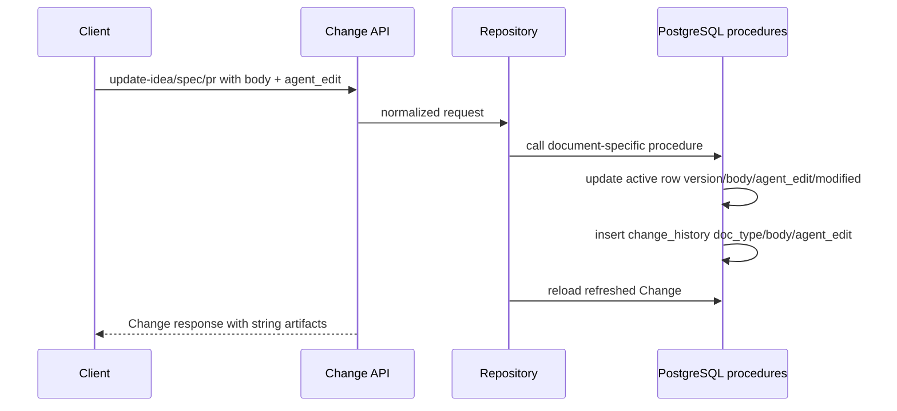

# Change Table `ref_uuid` and Redesigned History

Types: refactor|migration

## Goal

Deliver the redesigned Change identity, artifact, and history contract end-to-end so database initialization, backend APIs, frontend, CLI, docs, and tests all agree on `ref_uuid`, document-specific Change history, non-null artifact fields, and artifact-owned `agent_edit` behavior.

## Scope

- Finalize the Change table and history model introduced in `db/init.sql`.
- Rebuild demo seed data for the updated Change table and history procedures.
- Refactor backend Change persistence, DTOs, services, API handlers, rendering, tests, and docs for the new artifact contract.
- Update frontend and CLI clients for removed agent-edit endpoints, non-null artifact fields, empty-string artifact responses, and `agent_edit` on artifact update payloads.
- Keep implementation limited to the Change, Epic/Test Case aggregate behavior, docs, and tests directly affected by this contract.

## Requirements

### Docs

- Update product and architecture docs that describe Change artifact fields, history behavior, Change focused update endpoints, frontend Change rendering, CLI Change update flows, and verification expectations.
- Remove active documentation references to `POST /api/v1/change/update-idea-agent-edit` and `POST /api/v1/change/update-agent-edit`.
- Document that `idea`, `spec`, `spec_html`, `pr`, `pr_html`, and `pr_url` responses are strings, using empty text when no value exists.
- Document that `update-idea`, `update-spec`, and `update-pr` request payloads carry `agent_edit`.

### DB

#### Persistence Rules

- `public.change.ref_uuid` must exist, be generated on insert, be non-null, and be unique.
- `fn_change_insert` must create a Change with required `idea`, default active-row `agent_edit`, and an initial `change_history` row for `doc_type = 'idea'`.
- `public.change_history` must store document-specific history rows with `id`, `version`, `doc_type`, `body`, `agent_edit`, `modified`, and `deleted`.
- `sp_change_to_history` must remain removed from the active initialization contract.
- `sp_change_idea_update`, `sp_change_spec_update`, and `sp_change_pr_update` must update the active row, increment version, set modified time, set the active `agent_edit`, and insert matching document-specific history.
- `idea`, `spec`, `pr`, and `pr_url` must be non-null text values. Empty text represents no value for optional artifacts.
- `seed-demo.sql` must load successfully against the updated initialization contract and must not use obsolete nullable artifact assumptions or removed history procedures.

### Backend

#### API Contract

- Remove `POST /api/v1/change/update-idea-agent-edit` and `POST /api/v1/change/update-agent-edit`.
- `POST /api/v1/change/update-idea` must accept numeric `id`, non-empty string `idea`, and boolean `agent_edit`.
- `POST /api/v1/change/update-spec` must accept numeric `id`, non-empty string `spec`, and boolean `agent_edit`.
- `POST /api/v1/change/update-pr` must accept numeric `id`, non-empty string `pr`, and boolean `agent_edit`.
- `POST /api/v1/change/update-pr-url` must accept numeric `id` and a non-empty absolute `http` or `https` `pr_url` string.
- Null and empty request values for `idea`, `spec`, `pr`, and `pr_url` must be rejected as invalid input.
- Change list, get, create, Flow assignment, and focused update responses that return a Change object must include generated `ref_uuid` as a non-null string.
- `ref_uuid` is read-only API data; clients must not submit it in create or update payloads.
- Change detail and mutation responses must return string values, not nulls, for `idea`, `spec`, `spec_html`, `pr`, `pr_html`, and `pr_url`.
- PR URL validation must continue to accept only absolute `http` and `https` URLs on focused updates.

#### History Flow

#### Persistence Rules

- Backend Change creation must continue to use `fn_change_insert`.
- Backend artifact updates for `idea`, `spec`, and `pr` must call their document-specific procedures instead of generic SQL updates.
- Backend code must not call removed `sp_change_to_history`.
- Transactions that only supported legacy `sp_change_to_history` calls must be removed when the remaining mutation can be safely handled by a single repository operation.
- Create must keep the active row's default `agent_edit` value.
- After create, only `update-idea`, `update-spec`, and `update-pr` may mutate `agent_edit`.
- Existing title, type, epic, phase, open, PR URL, Flow, Run, and Test Case behavior must continue to work without generic Change history capture.
- Test Case and Epic history behavior remains in scope only when needed to keep existing Change mutation responses and completeness recalculation working.
- Epic updates and Test Case scenario updates must keep their existing active-row version increments because their history tables key repeated history rows by `(id, version)`.

#### Data Shape

- `dto.Change.Spec`, `dto.Change.SpecHTML`, `dto.Change.PR`, `dto.Change.PRHtml`, and `dto.Change.PRUrl` must be non-pointer strings.
- `ChangeUpdateIdeaRequest`, `ChangeUpdateSpecRequest`, `ChangeUpdatePRRequest`, and `ChangeUpdatePRUrlRequest` must stop using `*string` fields for artifact values.
- `dto.ChangeUpdateIdeaAgentEditRequest` must be removed with its endpoint.
- Markdown rendering must render `spec` and `pr` only when the string is non-empty and leave rendered HTML fields as empty strings when there is no source body.

### Frontend

- API wrappers, stores, composables, components, and tests must stop calling removed agent-edit endpoints.
- Change detail and edit flows must treat artifact and rendered artifact fields as strings.
- Empty artifact and rendered artifact strings must render as the no-value state without crashing or displaying `null`.
- Artifact update calls must send `agent_edit` on `update-idea`, `update-spec`, and `update-pr` when the UI can distinguish agent-generated edits from user edits.
- User-driven frontend artifact edits must send `agent_edit = false`.
- Frontend PR URL updates must send only non-empty absolute `http` or `https` URL strings.

### CLI

- `mch` API client types and request builders must stop using removed agent-edit endpoints.
- Agent rewrite saves must use `POST /api/v1/change/update-idea` with `agent_edit = true`.
- User-driven idea, spec, and PR saves must use the focused artifact endpoint with `agent_edit = false` unless that save is explicitly produced by an agent flow.
- CLI detail rendering must treat artifact and rendered artifact fields as strings and render empty strings as empty values.
- CLI tests that mention `update-idea-agent-edit` must be updated to the new `update-idea` plus `agent_edit` flow.

### Other

- Keep API integration tests HTTP-only; they must not inspect database tables directly.
- Do not introduce foreign keys or new broad locking protocols.

## Acceptance Criteria

### Docs

- Active docs no longer list or describe `update-idea-agent-edit` or `update-agent-edit` as supported endpoints.
- Active docs describe non-null artifact response fields, empty-string optional artifacts, and `agent_edit` on artifact update payloads.
- Verification docs or related QA notes identify backend, frontend, and CLI commands affected by this Change.

### DB

- A disposable database initialized from `db/init.sql` and `db/seed.sql` contains `change.ref_uuid` with a unique index and creates Change rows with generated UUIDs.
- `fn_change_insert` creates the active Change and initial idea history row.
- Calling `sp_change_idea_update`, `sp_change_spec_update`, or `sp_change_pr_update` updates the active artifact, increments version, stores the supplied `agent_edit`, and inserts a document-specific history row.
- `seed-demo.sql` can be loaded after `db/init.sql` and `db/seed.sql` without using removed procedures or null artifact values.

### Backend

- The backend builds with no references to `dto.ChangeUpdateIdeaAgentEditRequest`.
- Routes for `POST /api/v1/change/update-idea-agent-edit` and `POST /api/v1/change/update-agent-edit` are removed.
- Backend mutation paths do not call `public.sp_change_to_history`.
- `update-idea`, `update-spec`, and `update-pr` persist supplied `agent_edit` through the new procedures and return refreshed Change responses.
- Requests with `null` or empty strings for `idea`, `spec`, `pr`, or `pr_url` fail validation.
- Empty `spec`, `pr`, and `pr_url` values only represent never-submitted optional artifacts in responses.
- Rendered artifact responses return empty `spec_html` or `pr_html` strings when source markdown is empty.
- Change create responses include the default active-row `agent_edit` and string artifact fields.
- Change list, get, create, Flow assignment, and focused update responses expose `ref_uuid` consistently, and client request payloads do not submit `ref_uuid`.

### Frontend

- Frontend type checking passes with artifact fields modeled as strings.
- Frontend Change detail and edit flows no longer depend on nullable artifact values or removed agent-edit endpoints.
- Frontend API types accept `ref_uuid` on Change list, detail, create, Flow assignment, and focused update responses without submitting it in mutation payloads.
- Never-submitted optional PR URL and artifact fields render as empty strings after reload.
- Frontend tests cover the new artifact string contract and removed endpoint behavior where existing tests covered the former contract.

### CLI

- CLI builds with API client types that model artifact fields as strings.
- CLI API client types accept `ref_uuid` on Change list, detail, create, Flow assignment, and focused update responses without submitting it in mutation payloads.
- Agent idea rewrite save uses `update-idea` with `agent_edit = true`.
- User-driven artifact saves use artifact update endpoints with `agent_edit = false`.
- CLI tests no longer expect `update-idea-agent-edit`.

### Other

- Relevant backend, frontend, and CLI verification commands pass or any environment-only failures are reported with exact command and error output.

## Non-Goals

- Adding user-facing Flow assignment or Run controls to frontend or CLI.
- Changing Change reference allocation or slug semantics beyond exposing `ref_uuid`.
- Reworking Project, Epic, or Test Case APIs except where existing Change mutation responses require compatibility.
- Migrating live production data outside repository initialization and disposable test database workflows.
- Introducing foreign keys, advisory locks, isolation-level changes, or project-wide locking protocols.

## Design Notes

### Compatibility Notes

- This Change intentionally updates docs that currently describe nullable optional artifacts and the legacy agent-edit endpoints.
- Empty string is the compatibility representation for missing optional artifact data after the non-null refactor.
- `agent_edit` remains visible on active Change responses, but it is no longer independently editable after create.

### Persistence Rules

- Document-specific procedures own history for `idea`, `spec`, and `pr`.
- PR URL is a non-null string field but does not have a document-specific history procedure in this Change.
- Generic Change updates for title, type, epic, phase, open, and PR URL no longer use `sp_change_to_history`.
- Generic Change repository updates must not manually increment the Change active-row version; Epic and Test Case repositories keep version increments for their own history-bearing mutations.
- Existing simple transaction boundaries are preferred when multiple related mutations still need atomicity; do not add broader concurrency mechanisms.

### Data Movement

- Backend API DTO changes must be propagated outward to frontend and CLI clients in the same Change to prevent stale request and response contracts.
- The rendered HTML fields are derived response data and should follow the same empty-string no-value convention as their source artifacts.

## Relevant Specs

- `specs/117-change-table-ref-uuid-and-history.md`
- `agent/ideas/117-change-table-ref-uuid-and-history.md`
- `docs/architecture/backend-api.md`
- `docs/functionality/change-lifecycle.md`
- `docs/functionality/history.md`
- `docs/architecture/frontend-spa.md`
- `docs/architecture/mch.md`
- `docs/operations/verification.md`

## Verification

- From `backend`: `make lint`
- From `backend`: `make test`
- From `backend`: `make api-test`
- From `backend`: `make race`
- From repository root: `pnpm --dir frontend test`
- From repository root: `pnpm --dir frontend typecheck`
- From repository root: `pnpm --dir frontend build`
- From `cli`: `make lint`
- From `cli`: `go test ./...`
- From `cli`: `go build -o /tmp/mch ./cmd/mch`
- From repository root: `! rg -n "update-idea-agent-edit|update-agent-edit|sp_change_to_history|ChangeUpdateIdeaAgentEditRequest" backend frontend cli docs`

## QA Test Cases

### Backend

- Create a Change with project ID, title, and idea only; verify `ref_uuid` is returned, artifact fields are strings, `agent_edit` is default false, and initial idea history is created through the insert path.
- Update idea with `agent_edit = false`; verify idea changes, response is refreshed, and active `agent_edit` is false.
- Update idea with `agent_edit = true`; verify idea changes, response is refreshed, and active `agent_edit` is true.
- Update spec and PR with both user and agent `agent_edit` values; verify responses and history behavior.
- Submit empty strings for `idea`, `spec`, `pr`, and `pr_url`; verify validation failure and no mutation.
- Submit null for `idea`, `spec`, `pr`, and `pr_url`; verify validation failure and no mutation.
- Call removed `update-idea-agent-edit` and `update-agent-edit` routes; verify they are not available.
- Update title, types, epic, phase, open, PR URL, Flow assignment, Run state, and Test Case mutations; verify they still work without `sp_change_to_history`.
- Load demo seed data into a disposable initialized database and verify representative seeded Changes load through the backend.

### Frontend

- Open Change detail with empty `spec`, `pr`, `pr_url`, `spec_html`, and `pr_html`; verify the page renders empty values without null text or crashes.
- Edit spec, PR, and PR URL; verify payloads use non-empty strings and include `agent_edit` where applicable.
- Open Change detail for never-submitted optional artifact text or PR URL; verify empty strings render after reload.
- Verify no frontend API wrapper or test calls removed agent-edit endpoints.

### CLI

- Run the agent rewrite flow and verify the save request is `update-idea` with `agent_edit = true`.
- Run user-driven idea/spec/PR edits and verify artifact update requests send `agent_edit = false`.
- Render Change details with empty artifact strings and verify empty values display cleanly.
- Verify no CLI API client or test expects `update-idea-agent-edit`.

### Other

- Inspect docs and tests for stale nullable artifact assumptions and stale agent-edit endpoint references.

## Review Focus

- Database initialization and demo seed compatibility with non-null artifact fields and removed history procedure.
- Correct replacement of generic Change history with document-specific history procedures.
- Removal of legacy agent-edit endpoints across backend, frontend, CLI, docs, and tests.
- Validation for null and empty artifact update requests.
- Propagation of string artifact DTOs through markdown rendering, API responses, frontend types, and CLI client types.
- Verification evidence for all affected areas, especially API integration tests and CLI agent rewrite flows.

## Follow-Ups

- Consider a future data migration strategy for existing non-disposable databases if this schema contract is promoted beyond repository initialization and demo/test databases.
