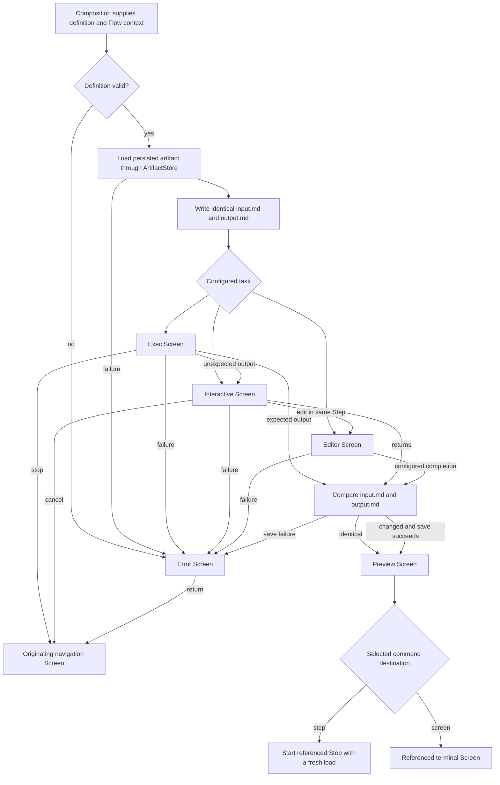

# CLI Flow 1: Reusable Flow Runtime

Types: feature|refactor|test|docs

## Goal

Provide an implementation-ready reusable CLI Flow runtime whose typed definitions, generic Screens, configured artifact workspace, Step lifecycle, validation, persistence boundary, and fakeable external-command execution can be composed into executable product Flows by later Changes.

## Scope

- Add typed, YAML-representable Flow definition values in `cli`.
- Add reusable Editor, Exec, Interactive, Preview, and Error Screens driven by definitions and runtime context.
- Add artifact-scoped files beneath the configured `temp_dir` and a shared Step load, compare, save, and transition lifecycle.
- Add a generic artifact persistence boundary and a Change API adapter for Idea, Spec, and PR loads and saves without connecting the runtime to an existing product route.
- Add definition, lifecycle, navigation, rendering, cancellation, error, persistence-boundary, Change API adapter, and external-process tests using conformance definitions and fakes.
- Update CLI architecture and verification docs for the reusable runtime and its later composition and configuration boundaries.
- Keep existing `/new-change`, Change-detail editing, loaded Flow configuration, and `/config` behavior unchanged.

## Requirements

### Docs

- `docs/architecture/cli.md` and `docs/architecture/mch.md` must describe the reusable Flow runtime, generic Screens, configured artifact workspace, typed destinations, composition boundary, and Change API-backed Idea, Spec, and PR persistence adapter.
- The docs must state that this Change does not compose the Idea Stage, connect the runtime to `/new-change` or Change-detail editing, or make the existing `.mch/default/flow.yaml` definition executable through the new runtime.
- The docs must preserve `temp_dir` from `.mch/config.yaml` as the root of runtime planning files and preserve existing `/config` behavior.
- `docs/operations/verification.md` must describe the definition, Screen, Step lifecycle, persistence-boundary, Change API adapter, external-command, navigation, cancellation, and error coverage expected from CLI tests.

### CLI

#### Glossary and Naming Conventions

- A `Flow definition` is immutable static behavior supplied to the runtime, regardless of whether a conformance definition is constructed in Go or a later product definition is loaded from YAML.
- A `Flow context` contains runtime-only values: configured temporary directory, active Change identity, originating navigation Screen, current session, current Step, current artifact, and current execution result.
- A `Step` operates on one artifact and contains one of the initially supported task combinations: Editor, Exec, Exec followed by Interactive, or Interactive.
- A `Screen` is one reusable Editor, Exec, Interactive, Preview, or Error component configured for a particular state; artifact-specific Screen implementations must not be introduced.
- A `command` is a user-facing Screen action whose definition maps it to one typed destination.
- A `destination` has exactly one kind: `step` references another Step in the same Flow, while `screen` references an allowed terminal navigation Screen.
- Supported artifact identifiers are exactly `idea`, `spec`, `pr`, `implement`, `review`, and `finalize`.
- `implement` identifies implementation work and `finalize` identifies finalization work.

#### Definition Model and Configuration Boundary

- Typed Flow definitions must represent definition, Step, task, and Screen identifiers; Screen and task type; artifact; prompt or script; expected output; available commands; command destinations; Preview next destination; and Screen-specific static options.
- Every static definition field must have an appropriate YAML tag and must be representable without runtime-only values.
- Runtime context values must not be stored in the static definition.
- Go-constructed conformance definitions must use the same definition types intended for later product and YAML-loaded definitions, pass the shared validator, keep static behavior in one definition, and return fresh independently mutable values on every construction call.
- The runtime must accept a completed definition through a composition boundary without knowing its source.
- Conformance definitions may exercise the runtime in tests, but this Change must not provide or start an executable Idea Rewrite, Idea Review, Spec Write, or other product Flow.
- This Change must not connect the reusable runtime to `.mch/default/flow.yaml`, replace the existing config loader, or change `/config`.

#### Definition Validation

- Validation must reject missing or duplicate definition, Step, task, Screen, and command identifiers where those identifiers are required for references.
- Validation must reject unsupported artifact, Screen, task, and destination kinds.
- Validation must reject task sequences other than Editor, Exec, Exec followed by Interactive, and Interactive.
- An Editor task must define its artifact, Editor Screen, Preview destination, and Error destination; prompt, script, expected output, and unexpected-output destination fields are forbidden.
- An Exec task must define its artifact, Exec Screen, prompt, script, exact expected output, Preview destination, unexpected-output Interactive destination, and Error destination.
- An Interactive task must define its artifact, Interactive Screen, session-resume script, Editor destination, Preview destination, and Error destination; prompt and expected output fields are forbidden. Its `/cancel` destination is the originating navigation Screen held in Flow context rather than static definition data.
- Validation must reject missing required fields and populated forbidden fields for the configured task and Screen type.
- Validation must reject commands without destinations and destinations without exactly one kind and reference.
- A `step` destination must reference a Step in the same definition; a `screen` destination must reference a terminal navigation Screen identifier supplied by composition.
- Composition must supply the validator with the allowed terminal navigation Screen identifiers; an empty, unknown, or runtime Flow Screen identifier is not a valid terminal `screen` destination.
- Editor completion may target only Preview, and Editor failure may target only Error.
- Interactive `/interactive` completion may target only Preview, `/edit` may target only an Editor Screen in the same Step, `/cancel` may target only the originating navigation Screen, and failure may target only Error.
- Preview commands may target a Step in the same definition or an allowed terminal navigation Screen supplied by composition.
- Validation must reject any destination outside those rules and a Step whose tasks do not use one consistent artifact.
- Validation failures must identify the invalid definition field or reference and must prevent runtime execution.

#### State and Flow Model



- A stopped, cancelled, or failed Step must not complete and must not invoke artifact persistence.
- Starting a `step` destination from Preview must create that Step's own persisted and file baseline; files from the previous Step must not be treated as the new Step's baseline.
- A `screen` destination must end the current Flow and navigate directly to the referenced allowed terminal Screen without starting another Step.
- A standalone Editor Step must load its artifact at Step start; an Editor Screen entered through Interactive `/edit` must reuse that Step's existing load, context, and files, must not return to Interactive, and must complete the Step through compare and save.

#### Artifact Workspace

- Flow composition must supply the configured `temp_dir` from `.mch/config.yaml` in Flow context; the runtime must not substitute a repository-root or built-in temporary path.
- Each artifact must use an isolated working directory at `<temp_dir>/<artifact>/`.
- Artifact resource paths must resolve to `<temp_dir>/<artifact>/session-id`, `<temp_dir>/<artifact>/input.md`, `<temp_dir>/<artifact>/output.md`, and `<temp_dir>/<artifact>/agent-output.md`.
- `input.md` is an immutable baseline for the duration of one Step; tasks may modify only `output.md`.
- At Step start, the runtime must create `<temp_dir>/<artifact>/` when it does not exist, then create or replace `input.md` and `output.md` with the successfully loaded artifact bytes; directory or file creation failure must enter the Error Screen.
- Editor requires `output.md`; Preview requires `input.md` and `output.md`; Exec must produce a readable `agent-output.md` before output evaluation; and `/interactive` requires a readable, non-empty `session-id`. `agent-output.md` remains optional when Interactive has no preceding Exec output.
- Missing configured temporary-directory data, a missing task-specific required resource, or an unsupported artifact identifier must enter the Error Screen.
- Supporting an artifact identifier in definitions and file resolution must not imply a concrete product persistence adapter or Preview composition for that artifact; this Change provides a Change API adapter only for `idea`, `spec`, and `pr`.

#### Step Lifecycle and Persistence Rules

- Flow composition must supply a fakeable `ArtifactStore` boundary that loads and saves plain artifact bytes without exposing backend, HTTP, database, or driver-specific values to the runtime or Screens.
- Every Step start must load its configured artifact through `ArtifactStore` using the active Change identity from Flow context.
- A successful load must write the exact persisted artifact bytes to both `input.md` and `output.md`.
- Starting Interactive after Exec in the same Step must reuse the same Flow context and artifact files without another load.
- Successful task completion must compare `input.md` and `output.md` byte-for-byte.
- Identical files must cause no `ArtifactStore.Save` call and must transition directly to Preview.
- Changed files must be sent to `ArtifactStore.Save`, and Preview may be entered only after that save succeeds.
- Artifact-specific validation, endpoint selection, and persistence metadata belong to the supplied store implementation, not to generic Screens or runtime branches.
- Load and save failures must enter the Error Screen without displaying a local-only success state.
- The CLI Change artifact store must load the active Change through `POST /api/v1/change/get`, select the requested `idea`, `spec`, or `pr` bytes, and save changed bytes through `POST /api/v1/change/update-idea`, `POST /api/v1/change/update-spec`, or `POST /api/v1/change/update-pr` respectively.
- Editor-initiated Idea, Spec, and PR saves are user edits and must send `agent_edit: false`; the adapter must reject unsupported artifacts rather than selecting an unrelated endpoint.
- The adapter must use the existing CLI API client boundary and must not access the database directly or alter backend persistence behavior.

#### Screen Inventory

##### Editor Screen

- Editor must be supported as a complete one-task Step that participates in the same load, compare, save, Preview, and error lifecycle as other Steps.
- The generic Editor Screen must open the current artifact's `output.md` in the configured external editor and wait until terminal control returns.
- Artifact, available commands, successful destination, and failure destination must come from its Screen definition and Flow context rather than artifact-specific branches.
- The same component must accept Idea, Spec, or PR artifact context.
- After the editor returns successfully, the Editor Screen must complete the Step through byte comparison and, when changed, the configured store save; it must enter Preview only after any required API save succeeds.
- Editor failure must enter the Error Screen without completing or saving the Step.

##### Exec Screen

- The generic Exec Screen must receive a configured prompt, script, exact expected terminal output, unexpected-output Interactive destination, Preview destination, and Flow context.
- While execution is represented as running, the Screen must offer only `/stop`.
- Successful execution must compare the final line of `agent-output.md` exactly with the configured expected output.
- Matching output must complete the Step through the compare-and-save lifecycle; non-matching output must enter the configured Interactive Screen in the same Step.
- `/stop` must cancel the active execution abstraction, skip output evaluation and persistence, and return to the originating navigation Screen.
- Execution failures must enter the Error Screen.
- Script and prompt paths must come from the definition. When paths such as `scripts/codex-exec-restore-session.sh` are later composed from `.mch/default`, they resolve relative to that active Flow directory rather than being hardcoded in the Screen.

##### Interactive Screen

- Entering the generic Interactive Screen must not start Codex automatically.
- The Screen must display preceding `agent-output.md` content when available and offer `/interactive`, `/edit`, and `/cancel`; it must not offer `/stop`.
- `/interactive` must hand terminal control to the configured fakeable session-resume boundary using the artifact's `session-id`.
- The configured session command may use a path such as `scripts/codex-resume-session.sh`, resolved by composition relative to the active Flow directory.
- The user may leave the external interactive session using any exit mechanism supported by that command.
- When the session returns successfully, the runtime must complete the Step through the compare-and-save lifecycle without comparing output to the preceding Exec expected value.
- `/edit` must open the current artifact's `output.md` in the configured generic Editor Screen within the same Step, without reloading the artifact; a successful editor return must complete that Step through compare and save rather than returning to Interactive.
- `/cancel` must skip persistence and return to the originating navigation Screen.
- Missing session data or failure to start the resume boundary must enter the Error Screen.

##### Preview Screen

- Preview must be an artifact checkpoint between a completed Step and a configured typed destination and must perform no artifact loads or saves.
- Preview must support prepared `idea`, `spec`, and `pr` artifact files; other supported artifact identifiers do not yet have Preview support.
- Preview mode must render `output.md`; Diff mode must render the difference between `input.md` and `output.md`.
- Left Arrow and Right Arrow must both toggle between Preview and Diff modes.
- Preview commands must be defined as user-facing command identifiers mapped to typed `step` or `screen` destinations; Screen code must not infer destination kind from command spelling.
- Selecting a `step` destination must start the referenced Step, which performs its own artifact load.
- Selecting a `screen` destination must end the Flow and navigate to the referenced terminal Screen without loading an artifact.

```shell
artifact_dir="$tmp_dir/$artifact"

# Preview mode
bat -pp --theme 'Coldark-Dark' "$artifact_dir/output.md"

# Diff mode
git --no-pager diff \
  --no-index \
  --no-ext-diff \
  --color=never \
  -- "$artifact_dir/input.md" "$artifact_dir/output.md" |
  bat -pp --theme 'Coldark-Dark' --language diff
```

- Git diff exit status `0` means identical files, `1` means files differ, and any status greater than `1` is an execution failure.
- The implementation must capture Git's status rather than the final `bat` process status, using `${PIPESTATUS[0]}` or an equivalent separate Git execution.
- A Preview rendering command failure must enter the Error Screen.

##### Error Screen

- The Error Screen must display the concrete validation, workspace, load, save, editor, execution, session, or rendering error.
- It must offer only `/return`.
- `/return` must navigate to the originating navigation Screen retained in Flow context.
- The Error Screen must not retry, save, continue, or infer a different destination.

#### External Commands

- External editor, preview, diff, execution, interactive-session, and Change API operations must run through fakeable boundaries so model and navigation tests do not execute real processes or contact a real backend.
- Long-running operations must return typed messages to the Bubble Tea update loop; `Update` must not directly perform process, filesystem, or persistence work.
- Exec stop handling must cancel the active operation before returning to the originating Screen.
- Command execution must preserve terminal handoff, process exit status, session resources, and configured working-directory behavior without embedding product-task names in generic runtime code.

### Other

- No backend, frontend, database, migration, seed, `.mch/default/flow.yaml`, prompt, or script changes are included; the CLI consumes only existing Change API contracts.
- The repository-root `db/**` tree remains read-only and no database operation is required by this Change.

## Acceptance Criteria

### Docs

- Active CLI architecture docs describe the uncomposed reusable runtime, generic Screens, configured `temp_dir` workspace, artifact persistence boundary, existing Change API adapter, and typed Preview destinations without changing current product Flow behavior.
- Verification docs identify automated coverage for definition validation, Screens, Step lifecycle, external commands, errors, cancellation, persistence boundaries, and navigation.

### CLI

- A valid fresh conformance definition passes the shared validator, and mutating one returned definition does not mutate a later returned definition.
- Invalid identifiers, types, task combinations, required or forbidden task fields, commands, artifacts, cross-task artifact use, or destination kind/reference combinations fail validation before execution with a field- or reference-specific diagnostic.
- The runtime accepts a validated definition and Flow context through a composition boundary without depending on whether the definition came from Go or YAML.
- Starting a Step loads its persisted artifact through the supplied store and writes identical exact bytes to `<temp_dir>/<artifact>/input.md` and `output.md`.
- A standalone Editor Step loads once, opens `output.md`, skips persistence when unchanged, saves changed Idea, Spec, or PR bytes through the matching focused Change endpoint with `agent_edit: false`, and reaches Preview only after success.
- Exec-to-Interactive continuation reuses the same baseline and runtime context without another artifact load.
- Unchanged output reaches Preview without a save; changed output reaches Preview only after the supplied store saves it successfully.
- Stopped, cancelled, failed, or unsuccessfully saved Steps never enter Preview and never perform an unintended save.
- Exec displays only `/stop` while running, compares the exact final output line, and routes matching, non-matching, stopped, and failed outcomes through their configured destinations.
- Interactive does not start a session on entry, exposes `/interactive`, `/edit`, and `/cancel` without `/stop`, and completes through the shared lifecycle after a successful session return or same-Step Editor completion.
- Preview renders prepared Idea, Spec, and PR files, toggles Preview and Diff with either horizontal arrow, and performs no persistence operation.
- A Preview command mapped to `step` starts the referenced Step with a fresh load; a command mapped to `screen` navigates directly to the referenced terminal Screen.
- Every defined failure route enters an Error Screen that exposes only `/return` and returns to the recorded originating Screen.
- CLI tests use fake artifact stores, API clients, editor, preview, diff, Exec, and Interactive boundaries; they do not start Codex or contact a real backend.
- Existing `/new-change`, Change-detail editing, `.mch/default/flow.yaml` loading, and `/config` remain unchanged and do not start the new runtime.

### Other

- The implementation changes no backend, frontend, database, prompt, script, or existing API behavior.

## Non-Goals

- Composing or connecting the Idea Stage.
- Connecting `/new-change` or Change-detail Idea editing to the reusable runtime.
- Defining or executing Idea Rewrite, Idea Review, Spec Write, or another product task sequence.
- Registering implementation, review, or finalization persistence adapters.
- Loading executable runtime definitions from `.mch/default/flow.yaml` or changing `/config` output.
- Defining or adopting a Flow Stage abstraction, complete pipeline, Step skipping, Step enablement, or Step mode switching.
- Changing backend APIs, database structures, seed data, frontend behavior, or existing product persistence contracts.

## Design Notes

### Compatibility Notes

- The current YAML loader, configured `temp_dir`, existing product Screens, and resolved `/config` view remain active compatibility behavior but do not compose the new runtime.
- Conformance definitions prove the shared types, validator, and runtime boundary without creating a second executable product Flow.
- Relative prompt and script paths are definition data whose base directory is supplied by later composition.
- Terminal navigation targets and their allowlist are supplied by composition so later Flow Changes can refine navigation without changing the destination representation.
- The task-field matrix, composition-supplied terminal allowlist, and task-specific resource preconditions are the minimum contract for this Change; later Flow Changes may extend them while preserving definitions that satisfy this contract.

### State and Data Notes

- Flow context, not Screen definitions, owns the configured temporary directory, active Change identity, originating Screen, session, artifact, and execution results so definitions remain serializable.
- Byte-for-byte comparison preserves exact artifact content and avoids writes when content has not changed.
- The runtime depends on an `ArtifactStore` abstraction so product-specific endpoints, validation, and persistence metadata remain outside generic Screens and can be composed by later Changes.
- The first concrete store maps only Idea, Spec, and PR to their existing focused Change API endpoints; generic runtime support for the other artifact identifiers is exercised with fakes until their owning Changes define persistence.
- Preview destinations form a tagged union: `step` references an internal Step, while `screen` references an allowed terminal navigation Screen. User-facing commands map to the union and are not themselves destinations.
- Editor is both a valid one-task Step and the terminal editing Screen for Interactive `/edit`; the standalone form loads at Step start, while the same-Step transition reuses the existing baseline and completes rather than returning to Interactive.

## Relevant Specs

- `specs/118-cli-flow-1.md`
- `docs/architecture/cli.md`
- `docs/architecture/mch.md`
- `docs/architecture/backend-api.md`
- `docs/operations/verification.md`
- `docs/docs-rules.md`

## Verification

- `cd cli && make lint`
- `cd cli && go test ./...`
- `cd cli && make race`
- `cd cli && go build -o /tmp/mch ./cmd/mch`
- `wc -l docs/architecture/cli.md docs/architecture/mch.md docs/operations/verification.md`
- `rg -n "Flow runtime|Flow definition|Flow context|ArtifactStore|temp_dir|input.md|output.md|Preview|destination|/return" docs/architecture/cli.md docs/architecture/mch.md docs/operations/verification.md`

## QA Test Cases

### CLI

#### Definitions and Composition

- Construct a conformance definition twice, mutate the first value, and verify the second remains unchanged and valid.
- Supply missing and duplicate identifiers, unsupported artifacts, Screen and task types, unsupported task combinations, absent required task fields, populated forbidden task fields, inconsistent task artifacts, missing command destinations, unknown Step and Screen references, and destinations with missing or multiple kinds; verify execution never starts and every diagnostic identifies the invalid field or reference.
- Supply equivalent Go-constructed definitions through the composition boundary and verify runtime behavior does not depend on their source.
- Start the normal application and verify `/new-change`, Change-detail editing, YAML loading, and `/config` remain unchanged and do not enter the conformance runtime.

#### Artifact Workspace and Step Lifecycle

- Supply a configured `temp_dir`, start each supported artifact context, and verify resources resolve beneath `<temp_dir>/<artifact>/` without a repository-root or built-in fallback.
- Omit the configured temporary directory, make artifact-directory creation fail, use an unsupported artifact, and remove each task-specific required resource; verify a concrete Error is shown before the affected operation proceeds.
- Load persisted bytes through a fake store and verify `input.md` and `output.md` contain those exact bytes while `input.md` remains unchanged for the Step.
- Complete a Step with identical files and verify Preview appears without a save call.
- Complete a Step with changed output, then succeed and fail the fake save separately; verify Preview appears only after success and failure enters Error.
- Stop, cancel, and fail Steps after changing local output and verify none invokes the store's save operation.
- Start a destination Step and verify it performs a fresh load and creates its own baseline instead of reusing the preceding Step's files as its baseline.

#### Exec, Interactive, and Editor

- Start standalone Idea, Spec, and PR Editor Steps and verify each loads once, creates the baseline files, opens `output.md`, skips its focused update when unchanged, and reaches Preview.
- Change each supported Editor artifact and verify the adapter calls only its matching focused Change endpoint with the active Change ID and `agent_edit: false`; verify save failure enters Error and never reaches Preview.
- Represent Exec as running and verify only `/stop` is available; stop it and verify cancellation, no save, and origin return.
- Return matching and non-matching final output lines and verify the exact-match path completes while the non-match path enters the configured Interactive Screen with the same files and context.
- Enter Interactive after Exec and as the first task of a Step; verify neither starts a session automatically, both display available preceding output, and both expose `/interactive`, `/edit`, and `/cancel` without `/stop`.
- Select `/edit` from Interactive and verify Editor reuses the same Step load and baseline, does not return to Interactive, and completes through the same compare, focused API save, and Preview ordering.
- Complete, fail, and cancel a fake Interactive session; verify save-and-Preview, Error, and no-save origin return respectively.
- Remove `session-id` and verify `/interactive` enters Error without starting a process.
- Open prepared Idea, Spec, and PR `output.md` files in generic Editor context and verify no artifact-specific Screen is selected.

#### Preview, Destinations, and Errors

- Render unchanged and changed prepared Idea, Spec, and PR files in Preview and Diff modes; verify either horizontal arrow toggles the mode and no persistence method is called.
- Configure commands with `step` and `screen` destinations and verify the first performs a fresh Step load while the second navigates directly without loading.
- Verify command spelling does not determine destination kind and invalid kind/reference combinations fail definition validation.
- Return Git diff statuses `0`, `1`, and greater than `1`; verify identical, different, and Error outcomes respectively even when the fake renderer succeeds.
- Trigger validation, workspace, load, save, editor, execution, session, and rendering failures; verify each Error Screen displays its reason, offers only `/return`, and returns to the recorded origin without retrying or saving.

## Review Focus

- Separation between serializable static definitions and runtime-only Flow context.
- Editor's dual entry paths, single-load guarantee, and save-before-Preview behavior through the existing focused Change API contracts.
- Preservation of the configured `temp_dir` contract without repository-root or built-in workspace fallbacks.
- Exact persisted-artifact baselines, immutable `input.md`, byte comparison, and save-before-Preview ordering.
- ArtifactStore isolation of generic Screens from HTTP and database details, plus correct Idea, Spec, and PR endpoint selection in the concrete CLI adapter.
- Typed command destinations and validation of internal Step versus terminal Screen references.
- Cancellation guarantees and no-save behavior for stopped, cancelled, failed, and unsuccessfully saved Steps.
- Generic Screen reuse and the absence of product Flow or route composition.
- Correct capture of Git diff status when output is piped through `bat`.

## Follow-Ups

- Compose the complete Idea Stage from the reusable runtime and connect successful Idea create and edit saves to its Rewrite Step.
- Add Spec Write and later Spec review behavior after the Idea Stage contract is implemented.
- Replace Go-constructed product definitions with validated YAML configuration and reconcile the existing Flow loader and `/config` view.
- Register implementation, review, and finalization persistence adapters when their owning Flow Changes define endpoint selection, validation, and persistence metadata.
- Refine task fields, terminal navigation targets, and resource preconditions as the next product Flow definitions establish additional concrete requirements.
