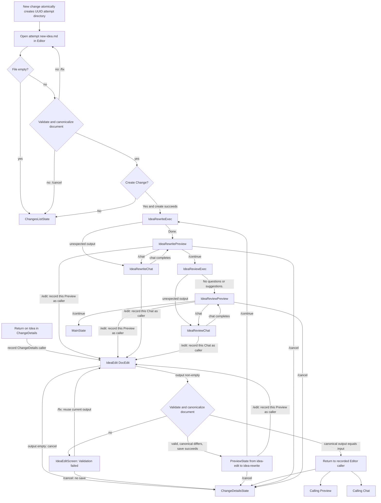
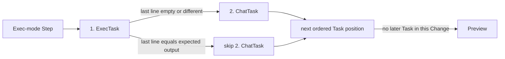

# CLI Flow 2: Complete Idea Stage

Types: feature|refactor|test|docs

## Goal

Users can create or edit a Change Idea, run its rewrite and review workflow through the reusable CLI Flow runtime, give the agent further instructions through Chat, and leave the completed Idea Stage without any legacy post-save workflow remaining active.

## Scope

- Compose a temporary built-in Go Flow definition for Idea rewrite, review, Chat-based agent instruction, editing, preview, cancellation, and errors.
- Connect successful Idea creation to Rewrite and connect Idea editing through the generic `DocEdit` validation, save, Preview, and `/continue` lifecycle while preserving create confirmation, focused-save, and navigation behavior, replacing resumable pre-create drafts with UUID-scoped `new-idea.md`, and standardizing Flow Preview commands with automatic `/chat` after Exec or Chat.
- Extend the generic runtime only where required for universal artifact validation and canonicalization, isolated artifact-local Editor workspaces, Editor recovery, mode-aware Preview commands, caller-aware canonical byte-identical Editor return, typed Chat `/edit` Step destinations, agent-versus-user save provenance, and ordered `1..n` Task traversal without conflating a Step with one of its Tasks.
- Replace the transitional Flow workspace contract with one Go `TmpDir` constant, remove `temp_dir` from repository configuration and `/config`, require the repository-root `.mch` and `.mch/tmp` directories at startup, and adapt the existing Codex execution and resume scripts to compose the Change- and artifact-scoped workspace from runtime environment values.
- Replace the hardcoded post-save Idea and Spec-generation path, its Idea-specific runtime support, and its parallel tests.
- Update active CLI architecture and verification documentation for the composed Idea Stage.

## Requirements

### Docs

- `docs/architecture/cli.md` and `docs/architecture/mch.md` must describe the composed Idea Stage, its generic Chat terminology and Screens, fresh UUID-scoped `new-idea.md` creation attempts and cleanup, universal artifact validation requiring a non-whitespace body plus artifact-local metadata canonicalization, state transitions, mode-aware Preview commands, repository-root Flow workspace, hardcoded temp root, required startup directories, removal of configured `temp_dir`, persistence provenance, navigation destinations, temporary final `/continue` destination, the Mode-defined Task types and order within a Step, the distinction between an ordered multi-Task Step and any individual Task, and the `IdeaRewriteExec`/`IdeaReviewExec` Step naming convention as current behavior.
- `docs/architecture/mch.md` must make the existing current-project navigation precondition explicit: without a valid positive numeric current project, the user remains in project selection and cannot reach `ChangesListState` or `ChangeDetailsState`, so the Idea Stage can assume that either entry Screen already carries valid project context and must not duplicate that guard inside the Flow.
- `docs/architecture/backend-api.md`, `docs/functionality/agent-interaction.md`, and `docs/functionality/change-lifecycle.md` must state that only `IdeaCreate` initializes the Change title from an artifact H1; later artifact titles and metadata remain independent from the Change and one another; canonical artifact metadata uses `Types: <type-slugs>` and `Epic: <epic-title> #<epic-id>`; and only explicit focused Change operations mutate Change title, types, or Epic while preserving an assigned slug.
- The architecture docs must no longer describe the reusable runtime as uncomposed or the legacy rewrite-to-Change-details path as active.
- `docs/operations/verification.md` must replace the legacy compatibility expectation with coverage of the built-in Idea definition, ordered `1..n` Task ownership and traversal, the `ExecTask` versus Exec-mode Step distinction, Chat skipping on matching Exec output, Chat execution on empty or unexpected Exec output, automatic Preview `/chat`, fresh non-resumable Idea creation, API-backed optional `Types:` and `Epic:` validation and deterministic canonicalization, generic `DocEdit` validation and save-and-Preview behavior, mode-aware Preview commands, empty-output cancellation, caller-aware canonical byte-identical return, terminal-only interactive Chat output, required startup directories, removal of configured `temp_dir`, rewrite and review paths, persistence provenance, external scripts, errors, navigation, and legacy removal.
- `docs/docs-rules.md` must record the non-mandatory naming reference: prefer dashes in file names, directory names, slugs, and angle-bracket placeholders, while retaining underscores for established database fields, API fields, environment variables, and script-local variables.
- Every edited documentation file must remain at or below 300 lines and describe current behavior rather than migration history.

### CLI

#### Glossary and Naming Conventions

- `IdeaCreate` is the new-Change Idea entry, document validation and canonicalization, confirmation, and backend-create path up to a successful persisted Change. Every `/new-change` invocation generates a UUID v4, atomically creates `$MCH_TEMP_DIR/<attempt-uuid>` without a pre-check, creates and opens its empty `new-idea.md`, and never resumes an earlier draft. The attempt UUID is runtime correlation identity only and is not sent as the backend-owned `ref_uuid`.
- `DocEdit` is the generic Editor Step for a configured `idea`, `spec`, or `pr` artifact: it loads the persisted document into byte-identical `<artifact>/editor/input.md` and `<artifact>/editor/output.md`, opens the Editor output, validates the universal title, optional metadata header, and required non-whitespace body, canonicalizes valid content, compares the canonical output with the Editor input, saves changed valid canonical output through the matching focused API, publishes that comparison pair to the artifact workspace for Preview, and then enters its configured Preview. The `editor` path component is a workspace scope, not a persisted artifact identifier.
- `IdeaEdit` is the Idea Stage's `DocEdit` configuration for artifact `idea`; `IdeaEditScreen` is its configured generic Editor Screen instance, its Preview transition is configured from `idea-edit` to `idea-rewrite`, and `/continue` starts `IdeaRewriteExec`.
- A `Task` is one executable unit owned by a Step and has one of the currently supported types `EditorTask`, `ExecTask`, or `ChatTask`. A Task is not a Step, and a Task type does not define a complete Step by itself.
- A `Step` owns an ordered sequence of `1..n` Tasks and has a `Mode` that determines which Task types compose the Step and their required order. A Step is not executable: selecting a Step reference activates its first ordered Task. The Mode vocabulary is `Editor`, `Exec`, `Chat`, and `Script`. The definition order is authoritative within the shape allowed by the Mode, the runtime tracks the current Task within that sequence, and eligible Tasks execute only in that predefined order; the runtime must not equate a Step, its Mode, its identifier, or its composed display name with an individual Task.
- The currently supported Mode shapes are an Editor-mode Step containing exactly `EditorTask`, a Chat-mode Step containing exactly `ChatTask`, and an Exec-mode Step containing exactly `ExecTask -> ChatTask`. Script-mode Steps are not introduced by this Change. The built-in Idea definition instantiates only Editor-mode and Exec-mode Steps.
- An Exec-mode Step is not an `ExecTask`: `ExecTask` occupies the first position and `ChatTask` the second, and the Step completes to Preview after the sequence has no further eligible Task.
- Exec completion validates, canonicalizes, and saves changed artifact output before selecting the next Task. When the last line of readable `agent-output.md` equals `expected_last_line_output`, only the following `ChatTask` is skipped and traversal continues after its position; because the current Exec-mode Step has no later Task, it completes to Preview. A missing final line because the file is empty, or a different final line, advances to `ChatTask` without completing or leaving the Step; successful Chat completion then advances beyond Chat and currently completes to Preview.
- Step ownership and traversal must allow a later Change to extend the applicable Mode contract with Task types before `ExecTask` or after `ChatTask` without changing the distinction between Step and Task or replacing ordered traversal with Step-specific transition logic. This Change does not add those future Tasks or accept any additional Step shape.
- `Chat` is the generic task and Screen for giving further instructions to the agent through the configured resumable session. Entering Chat displays available agent output without starting the session; `/chat` resumes it.
- Step names compose the configured Step name with its Mode for runtime and Screen vocabulary. `IdeaRewriteExec` therefore means the Step named `idea-rewrite` in Exec mode, and `IdeaReviewExec` means the Step named `idea-review` in Exec mode; neither name identifies the Step's `ExecTask`. Selecting either Step reference activates its first ordered Task.
- `IdeaRewriteExec` and `IdeaReviewExec` are Exec-mode Steps, each composed of an `ExecTask` followed by that same Step's `ChatTask` fallback for unexpected output.
- `IdeaRewriteChat` and `IdeaReviewChat` are the configured Chat states for the Rewrite and Review Steps.
- Every Flow Preview is an instance of the generic Preview Screen and records the `from-step` whose completed Task entered it. `/continue`, `/edit`, and `/cancel` are configured commands; `/continue` follows its configured typed destination, selecting a Step and activating its first Task or ending the Flow at an allowed terminal Screen, `/edit` selects its configured same-artifact Editor Step and activates its first Task, and `/cancel` always returns to `ChangeDetailsState`.
- When Preview's `from-step` has Exec or Chat Mode, Preview must also expose `/chat` between `/continue` and `/edit`; those Modes guarantee that `from-step` owns a `ChatTask`. `/chat` is a mode-derived Task transition that activates that `from-step`'s `ChatTask`, not a Step execution or a terminal Screen transition. Static configuration may include `/chat`, but its target is always derived from `from-step`; omission must synthesize the command rather than remove it. Exec-to-Chat and Preview-to-Chat transitions remain inside `from-step`, and the shared artifact preserves its session. An Editor-mode `from-step` does not receive `/chat`.
- The originating navigation Screen is `ChangesListState` for a newly created Change and `ChangeDetailsState` for a flow started by editing an existing Change.
- `ChangeDetailsState` is rendered by `ChangeDetailsScreen`; it is the fixed destination for explicit Editor `/cancel` and empty `IdeaEdit` output. Byte-identical `IdeaEdit` output instead returns to the Screen that entered Editor.
- The temporary home destination is `MainState`, rendered by `MainScreen`.
- `TmpDir` is the single Go constant declared as `const TmpDir = ".mch/tmp"`; it is the executable source of the Flow temp-root value, `$MCH_TEMP_DIR/<attempt-uuid>/new-idea.md` is the pre-persistence creation file, `MCH_TEMP_DIR` passes the same value to external scripts, and documentation may otherwise refer to it as `<temp-dir>` or `MCH_TEMP_DIR`.
- Angle-bracket placeholders use dashes, such as `<git-root>`, `<temp-dir>`, and `<ref-uuid>`. Established database fields, API fields, environment variables, and script-local variables retain underscores, such as `ref_uuid`, `MCH_REF_UUID`, and `artifact_dir`.

#### Built-in Definition and Composition

- Add one temporary built-in Go definition for the complete Idea Stage using typed definition values and generic Editor, Exec, Chat, Preview, and Error Screens; this Change renames the reusable agent-instruction task and Screen introduced by CLI Flow 1 to Chat.
- Rename the reusable definition, validator, runtime, model-message, operation-boundary, conformance, and test vocabulary for this behavior to Chat. The Go definition constants must be `TaskChat` and `ScreenChat`, both must use the exact serialized value `chat`, and the external-operation request and method must use `ChatRequest` and `Chat`. Supported task types are Editor, Exec, and Chat. Every Step must structurally own a non-empty ordered Task collection even when it currently has one Task, and its Mode must validate the collection's exact Task types and order. Supported shapes are Editor mode with exactly `EditorTask`, Chat mode with exactly `ChatTask`, and Exec mode with exactly `ExecTask -> ChatTask`; Exec is not a valid standalone Step shape, the reverse order is invalid, and Script-mode Steps and Script tasks are not introduced by this Change.
- Runtime progression must be expressed as traversal of the active Step's ordered Task collection. Exec expected-output evaluation may skip the immediately following Chat fallback, but it must resolve the next position after Chat rather than treating matching output as an intrinsic end-of-Step operation; Chat completion likewise resolves the next configured Task position. With the current two-Task Exec-mode shape, both paths end at Preview because no later Task exists.
- Exec unexpected-output validation must reference a configured Chat task and Chat Screen for the same artifact. Chat tasks must retain the existing session-resume script, Editor destination, Preview destination, Error destination, required and forbidden field rules, and same-Step lifecycle semantics under their new names.
- The constructor must return a fresh independently mutable definition on every call, and the completed definition must pass the shared validator before execution.
- The definition and composition layer must contain Idea-specific Step and command configuration; generic runtime and Screen code must not branch on Idea Step names, prompts, expected outputs, or navigation commands.
- The definition must contain the Idea-configured Editor-mode `DocEdit` Step (`IdeaEdit`) and the Exec-mode Steps `IdeaRewriteExec` (`idea-rewrite` plus Mode `exec`) and `IdeaReviewExec` (`idea-review` plus Mode `exec`), each with its ordered `ExecTask -> ChatTask` sequence, so each typed Step destination resolves to a Step inside the same definition and activates its first Task rather than treating the Step itself as executable.
- The Rewrite Exec task must use artifact `idea`, prompt `prompts/idea-rewrite.md`, script `scripts/codex-exec-restore-session.sh`, exact expected final line `Done.`, unexpected-output Rewrite Chat, Rewrite Preview, and the generic Error Screen.
- The Review Exec task must use artifact `idea`, prompt `prompts/idea-review.md`, script `scripts/codex-exec-restore-session.sh`, exact expected final line `No questions or suggestions.`, unexpected-output Review Chat, Review Preview, and the generic Error Screen.
- Every Rewrite and Review Chat task must use artifact `idea`, script `scripts/codex-resume-session.sh`, the generic Error Screen, its corresponding Preview, and a typed `/edit` Step destination to `IdeaEdit`.
- The `IdeaEdit` Editor task must use the generic Preview Screen configured from `idea-edit` to `idea-rewrite`; `/continue` must start `IdeaRewriteExec`, `/edit` must start `IdeaEdit`, and `/cancel` must return to `ChangeDetailsState`.
- `IdeaEdit` completes through Editor, so its Preview must expose exactly `/continue`, `/edit`, and `/cancel` with typed destinations `IdeaRewriteExec`, `IdeaEdit`, and `ChangeDetailsState` respectively.
- `IdeaRewritePreview` records `IdeaRewriteExec` as `from-step` and must expose exactly `/continue`, `/chat`, `/edit`, and `/cancel`. `/continue` selects `IdeaReviewExec` and activates its first Task, `/chat` activates `IdeaRewriteExec`'s `IdeaRewriteChat` task, `/edit` selects `IdeaEdit` and activates its first Task, and `/cancel` transitions to `ChangeDetailsState`. Omitting `/chat` from static Preview command configuration must still produce that mode-derived Task transition.
- `IdeaReviewPreview` records `IdeaReviewExec` as `from-step` and must expose exactly `/continue`, `/chat`, `/edit`, and `/cancel`. `/continue` transitions to `MainState`, `/chat` activates `IdeaReviewExec`'s `IdeaReviewChat` task, `/edit` selects `IdeaEdit` and activates its first Task, and `/cancel` transitions to `ChangeDetailsState`. Omitting `/chat` from static Preview command configuration must still produce that mode-derived Task transition.
- The final `/continue` must be a typed terminal Screen destination that temporarily exits the Idea Flow to `MainState`; it must not reference or execute a `SpecWrite` Step in this Change.
- Composition must supply `MainState`, `ChangesListState`, and `ChangeDetailsState` as allowed terminal Screens and preserve the originating Screen throughout nested Steps.
- The built-in definition must remain independent of `.mch/default/flow.yaml`; loading the product definition from YAML remains outside this Change.

#### State Model

- Starting `/new-change` must generate a UUID v4 and call one atomic directory-creation operation for `$MCH_TEMP_DIR/<attempt-uuid>` without checking existence first. An existence collision must generate another UUID and retry; any other creation failure enters Error. The runtime then creates the zero-byte `new-idea.md` inside that directory and opens it in Editor without offering `/resume`, `/clear`, or recovery of an earlier draft. Multiple `mch` instances and simultaneous attempts remain permitted and use isolated directories without locks or process coordination.
- If the attempt's `new-idea.md` is still zero bytes when Editor exits, `IdeaCreate` must make no API request, perform attempt cleanup, and return directly to `ChangesListScreen`.
- Non-empty `new-idea.md` must pass universal title and optional metadata validation and be rewritten to canonical metadata form before `Create Change?` is displayed. Selecting No must make no create request, clean the attempt, and return to `ChangesListScreen`; selecting Yes must create the Change from those canonical bytes before Rewrite starts. Only this create request initializes the Change title from the Idea H1.
- The UUID replaces the numeric validation ID as the attempt correlation token. Validation and backend-create result messages must carry it, and the runtime must ignore a reply unless its UUID matches the active attempt as well as the expected state. Cancellation still requests context cancellation, but an old command may write only its own isolated `new-idea.md` and can never rewrite a later attempt.
- Finishing or abandoning an attempt after empty output, cancellation, confirmation No, successful creation, or terminal editor, validation, canonical-write, or backend-create failure must remove `$MCH_TEMP_DIR/<attempt-uuid>/new-idea.md` first and then call directory-only removal for `$MCH_TEMP_DIR/<attempt-uuid>`. Missing paths are already clean. A non-empty-directory result is accepted so any other files that appeared under the same UUID, including a workspace captured by a matching backend `ref_uuid`, remain untouched; any other cleanup error enters Error. Validation `/fix` retains the same attempt UUID, file, and directory.
- Successful `IdeaCreate` persistence must start `IdeaRewriteExec` with `ChangesListState` as the origin.
- Return on the Idea row in `ChangeDetailsState` must start `IdeaEdit` with `ChangeDetailsState` as the origin.
- `/edit` from any Preview or Chat state must use a typed Step destination to start the first Step, `IdeaEdit`, from a fresh persisted Idea baseline rather than editing or saving an uncompleted Exec proposal in place, and must record the calling Preview or Chat Screen as the canonical byte-identical return destination.
- `IdeaEdit` must load the persisted Idea into byte-identical `idea/editor/input.md` and `idea/editor/output.md`, open the Editor output, then validate and canonicalize every non-empty submission before comparing canonical output with immutable Editor input byte-for-byte. Every new `IdeaEdit` Step replaces both Editor files from persistence, so no edit abandoned by a prior Step is recoverable.
- Non-empty `IdeaEdit` output whose canonical bytes differ from `input.md` must save as a user edit and enter the generic Preview configured from `idea-edit` to `idea-rewrite`; only `/continue` from that Preview starts `IdeaRewriteExec`.
- Empty `IdeaEdit` output must behave exactly like `/cancel`: it must make no update request, skip validation recovery, Preview, and Rewrite, and return to `ChangeDetailsState`.
- Canonical `IdeaEdit` output byte-identical to `input.md` must make no update request, skip the changed-output Preview and Rewrite transitions, and return to the recorded Editor caller: direct Change-details entry returns to `ChangeDetailsState`, Preview `/edit` returns to that same Preview, and Chat `/edit` returns to that same Chat Screen. This includes raw editor output that differs only in metadata spelling, spacing, line order, or type order and canonicalizes back to the persisted bytes.
- Every successful Exec completion must validate and canonicalize artifact `output.md`, compare it with `input.md`, and save changed canonical output before evaluating the final line of readable `agent-output.md`. Exact expected output must skip the immediately following Chat fallback and advance to the next ordered Task position, which completes the current two-Task Step and enters Preview. A missing final line because the readable file is empty, or any different final line, must advance in definition order to the current Step's Chat state without completing or leaving the Step, using the persisted Exec result as Chat's fresh baseline. A missing or unreadable `agent-output.md` remains an execution-resource failure and enters Error.
- Every Chat entry, whether reached from unexpected Exec output or Preview `/chat`, must preserve the configured session and workspace, load the latest persisted artifact, and replace `input.md` and `output.md` with those byte-identical persisted bytes before displaying available preceding Exec agent output. Entering Chat must not resume the session automatically. The interactive Codex transcript is visible to the user during terminal handoff but is not captured for later Flow rendering; after the session returns, the runtime reads artifact `output.md`, not the terminal transcript.
- Completing Rewrite or Review Chat successfully must validate and canonicalize `output.md`, compare it with the Chat-entry `input.md`, save changed canonical output, and advance to the next ordered Task position without rechecking the preceding Exec expected output. The current two-Task Step has no later Task, so it enters the corresponding Preview. Byte-identical canonical output must not save.
- `/cancel` from every Preview must perform no pending save and return to `ChangeDetailsState`; `/cancel` from Chat and `/stop` while Exec is running must perform no pending save and return to the recorded originating navigation Screen.
- Definition, execution, session, workspace, artifact load, artifact save, editor, Preview, Diff, metadata-option API, and canonical-write failures must enter the generic Error Screen; `/return` from Error must navigate to the recorded origin. Document-content validation failures in `IdeaCreate` or Editor must instead use generic in-place Editor recovery; validation failure in Exec- or Chat-produced output must enter Error because no Editor recovery session is active.

#### Document Validation and Recovery

- Every non-empty `idea`, `spec`, or `pr` artifact submitted for creation or focused persistence by `IdeaCreate`, Editor, Exec, or Chat must first replace every CRLF sequence with LF, then pass the same title, optional metadata, and required-body validation and be canonicalized before confirmation, byte comparison, persistence, or post-save Preview. Canonical artifact output therefore uses LF throughout. The rule is an unconditional artifact-submission invariant, not definition or composition configuration, and generic code must not branch on artifact, Step name, prompt, or validation text.
- Every submitted document must begin on line 1 with exactly one complete H1 title line matching `# <non-blank title>`. The title must not span multiple lines and is preserved byte-for-byte by canonicalization. For `IdeaCreate` only, the parsed H1 initializes the Change title in the create request. Every later Idea, Spec, or PR H1 is artifact-local validation content and never updates the Change title.
- The title and every present metadata field must each be followed by exactly one blank line. After the title separator, the optional metadata header contains zero, one, or two fields; when both fields are submitted, each has its own following blank separator. The five accepted header shapes are title then blank, title then blank then `Types:` then blank, title then blank then `Epic:` then blank, title then blank then `Types:` then blank then `Epic:` then blank, or title then blank then `Epic:` then blank then `Types:` then blank. Every shape must then contain a document body with at least one non-whitespace character; title-only and metadata-only documents are invalid. Each metadata field may appear at most once. A missing or repeated required separator and a duplicate header field are invalid; after the first non-metadata body line, later metadata-looking text is document body and is neither validated nor canonicalized as header metadata.
- A present `Types:` line must occupy the complete line, use the exact case-sensitive `Types:` prefix, and contain one or more values separated by `|`. Validation trims surrounding whitespace from each value, rejects an empty value, duplicate slug, or slug absent from `POST /api/v1/options/change-types-list`, then emits the selected slugs once each in the order returned by that API. The canonical complete line is exactly `Types: <type-slugs>`, with one ASCII space after the colon, `|` separators, and no other whitespace; for example, `Types: feature|test|ci`.
- A present `Epic:` line must occupy the complete line, use the exact case-sensitive `Epic:` prefix, and match `^Epic:\s*(\S(?:.*\S)?)\s+#([0-9]+)\s*$`. Validation parses capture group 2 as a base-10 ID and requires that numeric ID to match an Epic returned by `POST /api/v1/epic/list` for the current project. The supplied non-blank title is not required to equal the current title. Canonicalization trims surrounding whitespace from the matched API Epic title, rejects a blank result or any title containing `\r` or `\n`, preserves its remaining internal characters, and emits exactly `Epic: <epic-title> #<epic-id>`, with single ASCII spaces and the API's numeric ID representation; for example, `Epic: Epic-Title #11`.
- When both fields are present, canonicalization always writes `Types:` first and `Epic:` second regardless of their submitted order. A missing field remains missing and does not get inferred from or copied to the Change. Canonicalization emits exactly one blank line after the H1 and after each present metadata field while preserving all remaining body bytes and final-newline structure after CRLF-to-LF normalization.
- Type and Epic options must come from API responses at submission time and must not be hardcoded. Validation calls `POST /api/v1/options/change-types-list` only when a `Types:` header exists and `POST /api/v1/epic/list` only when an `Epic:` header exists; a missing optional field must not trigger its API. Composition supplies a fakeable document-metadata option boundary backed by the existing CLI API client; generic validation receives ordered type slugs and plain Epic IDs and titles without exposing HTTP or backend DTOs to Screens.
- Missing `Types:` or `Epic:` metadata is valid. A body absent or blank after trimming, a missing or repeated required blank separator, duplicate or malformed header field, empty or duplicate type token, unknown type slug, or Epic ID absent from the current-project response is a content-validation failure and must not rewrite or persist the document or enter confirmation or Preview. Body validation occurs before loading optional metadata values, so title-only and metadata-only submissions make no option API request. Failure to retrieve a required option set, a backend Epic title blank after trimming or containing `\r` or `\n`, or failure to write canonical bytes must enter Error without persistence, confirmation, or Preview.
- Successful validation must rewrite the current submission to canonical bytes before any `IdeaCreate` confirmation and before a `DocEdit` byte comparison. `Create Change?` must render the canonical Idea and successful creation must submit those bytes. `DocEdit` must compare canonical `output.md` against immutable `input.md`: equality is the caller-aware no-save outcome, while inequality uses the focused artifact update and save-before-Preview lifecycle. Canonicalization may therefore turn a raw edit into a no-op or make an otherwise unchanged legacy document require a focused canonicalizing save.
- Exec and Chat completion must apply the same validation and canonicalization before their changed-byte decision and any agent save. Canonical output equal to that task entry's freshly loaded `input.md` is unchanged and makes no focused update; different canonical output is saved with `agent_edit: true`. Exec must complete this persistence decision before expected-output routing, and every Chat entry must fresh-load the latest persisted artifact into both baseline files before the session can resume. Content-validation failure in agent-produced output must enter Error without persistence or Preview because no Editor recovery session is active.
- A zero-byte, title-invalid, or missing-body artifact `output.md` produced by Exec or Chat is a document-content validation failure and enters Error without persistence or Preview. This is distinct from readable `agent-output.md`: an empty `agent-output.md` is an expected-output mismatch and routes to the current Step's Chat task.
- Title parsing failure in `IdeaCreate` or Editor must display the exact user error `# Title parsing failed`; a missing non-whitespace body must display `document body must contain at least one non-whitespace character`; type and Epic failures must display a concrete error identifying the malformed, duplicate, empty, or unknown value. Every Editor content-validation failure must offer exactly `/fix` and `/cancel`.
- `/fix` must reopen the current invalid file without replacing it, canonicalizing it, or reloading persistence. For `DocEdit`, the Step's `input.md` baseline must remain immutable. `/cancel` must abandon the current output and perform no persistence; `IdeaCreate` returns to `ChangesListScreen`, while `DocEdit` returns to `ChangeDetailsScreen`.
- Empty generic Editor output is cancellation rather than content-validation failure. It must perform the same no-save transition as `/cancel`, must not display a validation error or `/fix`, and must return to `ChangeDetailsScreen`; only non-empty malformed output enters validation recovery.
- Artifact title, Types, and Epic are independent of the Change fields and of the corresponding metadata in every other artifact. Saving an Idea, Spec, or PR must call only that artifact's focused endpoint and must never update the Change title, Change types, linked Epic, ref, or slug. Those Change fields change only through their explicit Change operations; assigning a Flow may initialize ref and slug, and later artifact saves preserve them.
- Starting a later `IdeaCreate` must allocate a new UUID workspace, and starting a later `DocEdit` must load the latest persisted artifact into both files; `/fix` preserves only the current invalid attempt and never recovers a previous or abandoned edit.

#### Caller-Aware Editor Completion

- Preserve the generic Editor non-empty submission lifecycle: validate and canonicalize output, compare canonical bytes with the immutable input, save differing bytes through `ArtifactStore`, then enter the configured Preview only after that save succeeds; empty output uses cancellation instead.
- Extend the reusable runtime so every Editor entry records its calling Screen independently from the fixed explicit-cancel destination. Canonical output byte-identical to the immutable input must return to that recorded caller instead of entering the changed-output Preview.
- Direct `IdeaEdit` entry from `ChangeDetailsState` must record `ChangeDetailsState`; Preview and Chat `/edit` must record the exact Preview or Chat Screen that initiated the Editor. Returning canonical output byte-identical to the input must perform no persistence and must not start Rewrite or another Step.
- Editor completion validation must reject a missing or invalid changed-output Preview or Preview next-Step destination. Editor entry must reject a missing or invalid recorded caller before opening Editor; the caller must be either an allowed terminal Screen or the active definition's configured Preview or Chat Screen.
- These capabilities must be generic definition behavior parameterized by artifact and destinations; runtime branches must not identify Idea, Spec, PR, `IdeaEdit`, or `IdeaRewriteExec`.
- Existing conformance behavior in which canonical byte-identical output returns to Preview must remain representable by recording that Preview as the Editor caller.

#### Configurable Chat Edit Destinations

- Extend the reusable definition and runtime so Chat `/edit` may retain the existing same-Step Editor destination or use a typed Step destination to an Editor Step in the same definition.
- A typed Chat `/edit` Step destination must reference an Editor Step for the same artifact; selecting it must abandon the current uncompleted proposal without persistence, start the referenced Step with a fresh persisted load and file baseline, and record the calling Chat Screen so canonical byte-identical Editor output returns there.
- Every Idea Rewrite and Review Chat task must configure `/edit` as a typed Step destination to `IdeaEdit`, the first Step in the built-in definition.
- Chat edit-destination validation must reject a missing or unknown destination, a non-Editor target Step, an artifact mismatch, or a terminal Screen destination before execution.
- These capabilities must remain generic definition behavior; runtime and generic Screen code must not identify Idea, `IdeaEdit`, prompts, or command spellings when resolving the destination.
- Existing conformance behavior in which Chat `/edit` opens the same Step's Editor and reuses its active files must remain representable under the renamed contract.

#### Configuration and Startup

- Repository configuration must no longer define or load `temp_dir`. Remove the field from the committed `.mch/config.yaml` shape, typed config values, validation, and `/config` rendering; a configured path must not influence Flow workspace resolution.
- After resolving the Git root and before starting the TUI, `mch` must require both `<git-root>/.mch` and `<git-root>/.mch/tmp` to exist as directories. If either is missing or is not a directory, startup must fail with a path-specific error and must not create it or start the interactive application.
- The runtime may atomically create UUID attempt directories and their `new-idea.md`, plus Change- and artifact-scoped descendants beneath the existing `.mch/tmp` directory, but no runtime path may create or substitute the `.mch` or `.mch/tmp` root.
- `TmpDir` is the only runtime temp-root source. Config loading, `/config`, Flow context, scripts, tests, and docs must not retain an alternative configured temp-root contract.

#### Commands and Keybindings

- `/new-change` must atomically allocate and open `$MCH_TEMP_DIR/<attempt-uuid>/new-idea.md`, must clean the attempt and return to `ChangesListScreen` when the edited file is empty, and must not expose `/resume` or `/clear`; invalid non-empty content must expose exactly `/fix` and `/cancel` before create confirmation.
- `Create Change?` is the pre-persistence Yes/No confirmation shown only after validation succeeds; it is not a generic Flow Preview and does not use the mode-aware Preview command set.
- Return on the selected Idea row in `ChangeDetailsState` must open the active Idea's generic Editor Screen with `ChangeDetailsState` recorded as its canonical byte-identical return destination.
- Empty `DocEdit` output must immediately perform the `/cancel` outcome without validation recovery. Any non-empty changed invalid `DocEdit` must expose exactly `/fix` and `/cancel`; `/fix` reopens its current output and `/cancel` returns to `ChangeDetailsScreen` without persistence.
- Every Flow Preview must expose `/continue`, `/edit`, and `/cancel`, in that relative order. `/continue` must follow its configured next destination and activate the referenced Step's first Task when that destination is a Step; `/edit` must select its configured same-artifact `DocEdit` Step, activate its first Task, and record that Preview as the canonical byte-identical return destination; `/cancel` must return to `ChangeDetailsScreen`. All three built-in Idea Previews configure `/edit` to `IdeaEdit`.
- A Preview whose `from-step` has Exec or Chat Mode must always insert `/chat` between `/continue` and `/edit`, producing `/continue`, `/chat`, `/edit`, and `/cancel`. The runtime must derive `/chat` from `from-step` and activate that Step's same-artifact `ChatTask`; static configuration may declare the command but cannot redirect it to another Task, Step, or Screen. This transition never changes Step. A Preview whose `from-step` has Editor Mode must not synthesize `/chat`.
- `IdeaEdit` Preview `/continue` must start `IdeaRewriteExec`; `IdeaRewritePreview` `/continue` must start `IdeaReviewExec`; `IdeaReviewPreview` `/continue` must temporarily exit to `MainState` without starting `SpecWrite`.
- Shared Preview validation must require the mode-derived command set, a valid configured continuation destination, a same-artifact Editor Step for `/edit`, and `ChangeDetailsState` for `/cancel`. It must validate and retain `from-step`, accept omitted static `/chat` when `from-step` has Exec or Chat Mode because the runtime synthesizes it, require any declared `/chat` to resolve only to `from-step`'s same-artifact `ChatTask`, and reject `/chat` when `from-step` has Editor Mode. Missing, additional, duplicated, or invalid commands, destinations, `from-step` references, or mode-derived Task transitions must fail definition validation before execution.
- While either Exec is running, `/stop` must remain the only Flow command.
- Each Chat Screen must display available review or rewrite output and offer exactly `/chat`, `/edit`, and `/cancel`; `/chat` must resume the configured agent session so the user can give further instructions, `/edit` must record that Chat Screen as the canonical byte-identical return destination, and `/cancel` must retain its origin-return behavior.
- Generic Preview and Diff rendering and horizontal-arrow mode toggling must remain unchanged.

#### Persistence Rules

- `IdeaCreate` must persist its validated canonical Idea before `IdeaRewriteExec` starts. Non-empty valid `IdeaEdit` whose canonical bytes differ from `input.md` must persist before its Preview, and `IdeaRewriteExec` may start only after `/continue` from that Preview.
- Starting every Rewrite or Review Step and entering every Chat state must load the latest persisted Idea and replace both `<git-root>/<temp-dir>/<ref-uuid>/idea/input.md` and `<git-root>/<temp-dir>/<ref-uuid>/idea/output.md` with those exact bytes. Starting an Editor Step must instead replace `<git-root>/<temp-dir>/<ref-uuid>/idea/editor/input.md` and `<git-root>/<temp-dir>/<ref-uuid>/idea/editor/output.md`, leaving the artifact workspace comparison pair untouched so canonical byte-identical return preserves the calling Preview or Chat workspace. Chat entry must preserve the configured session and artifact workspace while refreshing its baseline.
- Preview must perform no database or API operation; starting its next Step must create that Step's fresh persisted baseline.
- Document validation and canonicalization may read current type and Epic options from supported APIs, but Preview itself must perform no API operation.
- Extend the generic artifact persistence boundary with save provenance rather than deriving `agent_edit` from the artifact or Step name.
- Exec and Chat completion whose validated canonical bytes differ from their freshly loaded `input.md` must save Idea content through `POST /api/v1/change/update-idea` with `agent_edit: true`. Exec persistence must finish before expected-output routing to Preview or Chat; Chat persistence must finish before Preview.
- Non-empty Editor completion whose validated canonical bytes differ from the Editor `input.md` must save Idea content through `POST /api/v1/change/update-idea` with `agent_edit: false`, then publish the Editor input/output comparison pair to the artifact workspace before entering Preview.
- Empty, canonical byte-identical, or content-invalid `IdeaEdit` completion must make no focused-update request. Empty completion must cancel to `ChangeDetailsState`; canonical byte-identical completion must return to the recorded Editor caller; non-empty invalid completion must remain in generic recovery until `/fix` or `/cancel`. Canonicalization or save failure must enter Error without Preview, Rewrite, or local-only success state.
- The persistence extension must continue to select focused endpoints by artifact and reject unsupported or blank artifacts without exposing HTTP or backend DTOs to generic Screens.

#### External Commands and Workspace

- Define the concrete temp-root literal exactly once in executable source code, as the Go Flow runtime's `TmpDir` constant. Shell scripts must receive the value through `MCH_TEMP_DIR`, and tests must compare against `TmpDir` rather than redeclaring their own runtime constant.
- `IdeaCreate` must resolve its logical `$MCH_TEMP_DIR/<attempt-uuid>/new-idea.md` path as `<git-root>/<temp-dir>/<attempt-uuid>/new-idea.md` using the same `TmpDir` value. The existing `<git-root>/<temp-dir>` directory is a startup precondition and must not be created by `IdeaCreate`; the attempt directory must be allocated only by atomic `mkdir` without a pre-check.
- The Go Step lifecycle must resolve each artifact workspace as `<git-root>/<temp-dir>/<ref-uuid>/<artifact>` using `TmpDir` for `<temp-dir>` and may create the `<ref-uuid>/<artifact>` descendants beneath the existing temp root. Editor-mode Steps use the artifact-local `<artifact>/editor` subdirectory for their input and output; Exec, Chat, scripts, sessions, agent output, and Preview use the artifact workspace root. `editor` must not be passed as `MCH_ARTIFACT` or treated as a focused-persistence artifact.
- The external-operation boundary must continue to provide `MCH_REF_UUID` and `MCH_ARTIFACT`, and must pass the `TmpDir` constant value to scripts as `MCH_TEMP_DIR`.
- `MCH_TEMP_DIR` must contain only `<temp-dir>`, not an already-resolved artifact workspace.
- `scripts/codex-exec-restore-session.sh` and `scripts/codex-resume-session.sh` must resolve the Git root and compose their workspace as `<git-root>/$MCH_TEMP_DIR/$MCH_REF_UUID/$MCH_ARTIFACT`; in prose this path is `<git-root>/<temp-dir>/<ref-uuid>/<artifact>`.
- `MCH_TEMP_DIR`, `MCH_REF_UUID`, and `MCH_ARTIFACT` are all required; a missing value, invalid UUID, or unsupported artifact must fail without using a fallback workspace.
- The scripts must use the composed workspace for `session-id`, `input.md`, `output.md`, `agent-output.md`, `events.jsonl`, and `error.log`.
- Prompt `/tmp-dir/` substitution must resolve to that same composed artifact workspace used by the Step lifecycle.
- Exec must leave a readable `agent-output.md` and session ID in that workspace for exact output evaluation and later Chat resume. The readable file may be empty; an empty file has no matching final line and therefore routes to Chat rather than Error.
- Chat entry must fresh-load the latest persisted Idea into byte-identical `input.md` and `output.md` in the configured workspace, retain the configured Idea session, display available preceding Exec agent output, and not resume automatically when its Screen opens. The resumed interactive Codex transcript remains terminal-only and is not copied into `agent-output.md`; Chat completion observes artifact changes through `output.md`.
- Execution-script, prompt, editor, Chat-session, Preview, Diff, and backend operations must remain fakeable in model tests, and long-running operations must not block the Bubble Tea update loop.

#### Legacy Flow Removal

- Keep current-attempt document validation, create confirmation, Change creation, focused Idea update, and backend-save error behavior through the point where persistence succeeds.
- Remove `initial-idea.md`, `/resume`, `/clear`, and every prior-draft recovery path from `/new-change`; allocating and editing `$MCH_TEMP_DIR/<attempt-uuid>/new-idea.md` must be the only Idea creation entry.
- After successful create persistence, Rewrite must be the only active continuation. After changed edit persistence, the configured Preview and its `/continue` destination to Rewrite must be the only active post-save Idea path.
- Remove legacy specialized post-save states, agent model fields, commands, messages, runner methods, workspace resources, views, handlers, transitions, and tests that exist only for the superseded rewrite or Spec-generation workflow.
- Remove the superseded `Interactive` task, Screen, state identifiers, `/interactive` command, and `interactive-session` boundary terminology; `Chat`, its configured states, `/chat`, and the chat-session boundary must be the only active technical vocabulary for this behavior.
- Remove or disconnect every compatibility path that can start the old rewrite or old Spec-generation flow, including preserved future-use methods that bypass the built-in Idea definition.
- Retain code shared with unrelated CLI behavior, but remove its legacy Idea-flow branches.
- Replace removed tests with coverage of the composed generic Idea Stage rather than retaining parallel legacy expectations.

### Other

- No backend, frontend, database, migration, seed, or API contract changes are included.
- No file under `db/**` and no database state may be changed by this Change.
- No Spec writing, Spec artifact persistence, Spec review, later Flow stage, or YAML product-definition composition is included.
- No Script task type, Script Step shape, or Script Screen behavior is included.

## Acceptance Criteria

### Docs

- Active CLI docs describe the composed generic Idea Stage, isolated non-resumable UUID-scoped `new-idea.md` creation and two-step cleanup, universal title, required non-whitespace body, optional API-backed artifact-local metadata validation and deterministic canonicalization, mode-aware Preview commands with automatic Chat after Exec or Chat, required `.mch` and `.mch/tmp` startup directories, removal of configured `temp_dir`, and no longer present the legacy rewrite-to-details path or an uncomposed runtime as current behavior.
- Active CLI architecture docs distinguish a Step from a Task, define a Step as an ordered collection of `1..n` Tasks whose types and order are determined by its Mode, identify `IdeaRewriteExec` and `IdeaReviewExec` as Exec-mode Step names rather than Task identifiers, identify the current Exec-mode Step shape as exactly `ExecTask -> ChatTask`, and explain that matching Exec output skips Chat while empty or different output advances to Chat without leaving the Step. They must also identify ordered traversal as the extension boundary for future Mode contracts without describing future Tasks as implemented.
- Active CLI docs state that valid current-project selection is a navigation precondition: without it the user cannot reach Change list or details, and the Idea Stage therefore receives valid project context from either entry Screen without adding a second Flow-local guard.
- Backend API and lifecycle docs distinguish the one-time Idea-create title initialization from later validation-only artifact H1s, define canonical artifact-local Types and Epic formats, allow different metadata across Change, Idea, Spec, and PR, and reserve Change title, type, and Epic mutations for explicit focused Change operations without regenerating an assigned slug.
- Verification docs cover every Idea Stage route, ordered `1..n` Task ownership and progression, the `ExecTask` versus Exec-mode Step boundary, exact Exec-then-Chat ordering, conditional Chat skipping, generic `DocEdit` validation, canonical comparison, and save-and-Preview behavior, type and Epic API validation and canonical formatting, mode-aware Preview commands, empty-output cancellation, empty or unexpected Exec agent output routing to Chat, terminal-only interactive Chat output, caller-aware canonical byte-identical return, provenance-sensitive save, artifact/Change field independence, startup configuration, runtime workspace scripts, error classes, navigation, and legacy-path removal.
- Documentation uses the dash-oriented naming reference for new file names, directory names, slugs, and placeholders while retaining established underscore-based field and script-variable names.
- Every edited doc remains at or below 300 lines.

### CLI

#### Composition and Navigation

- A fresh built-in Idea definition validates and executes through the generic runtime with no Idea-specific conditional in runtime or generic Screen code.
- Every validated Step owns an ordered non-empty Task collection whose exact Task types and order match its Mode, and runtime state identifies both the active Step and current Task position. A Step is never executed directly: selecting a Step reference activates its first Task. `IdeaRewriteExec` and `IdeaReviewExec` identify Exec-mode Steps, while `ExecTask` identifies their first Task; those concepts remain distinguishable in definitions, runtime state, messages, destinations, and tests.
- The current Exec-mode Step validates only as the exact ordered pair `ExecTask -> ChatTask`. Matching Exec output skips Chat and advances beyond its position; empty or non-matching Exec output advances to Chat; successful Chat completion advances beyond Chat. Both current paths reach Preview only because the Step has no later Task.
- Ordered progression must be implemented without a fixed assumption that Exec is permanently the first possible Task in every future Step or Chat permanently the final possible Task. Unsupported Task types and additional Task shapes remain rejected in this Change, but adding supported Tasks before or after the Exec/Chat pair later must not require redefining Step ownership or replacing the ordered traversal model.
- Generic Chat definitions support both the existing same-Step Editor destination and a typed same-artifact Editor Step destination; the Idea definition routes every Chat `/edit` to the first Step, `IdeaEdit`, with a fresh persisted load.
- Definition and Screen type values, runtime state, typed messages, requests, operation methods, conformance definitions, and tests use Chat naming and the serialized `chat` discriminator; the superseded discriminator and command are rejected or absent.
- Every `/new-change` atomically creates and opens a fresh `$MCH_TEMP_DIR/<attempt-uuid>/new-idea.md`, cleans the attempt when Editor leaves it empty, and cannot resume or recover an earlier attempt.
- `Create Change?` appears only after the non-empty Idea passes the universal title and non-whitespace body rules and any present `Types:` and `Epic:` fields match current API responses and have been rewritten canonically; confirmation renders those canonical bytes, invalid content or option-loading failure makes no create request, and successful create initializes the Change title from that Idea H1.
- Successful new-Change creation starts Rewrite with origin `ChangesListState`; Change-details Idea editing starts the Idea-configured `DocEdit` Step with origin `ChangeDetailsState`.
- Return on a Change-details Idea loads the persisted Idea into identical `idea/editor/input.md` and `idea/editor/output.md`, records `ChangeDetailsState` as the Editor caller, and opens the Editor output; an editor submission whose canonical bytes equal the Editor input performs no update or Codex execution and returns to that caller.
- A valid editor submission whose canonical bytes differ from the Editor `input.md` saves with `agent_edit: false`, publishes the comparison pair to the artifact workspace, enters Preview configured from `idea-edit` to `idea-rewrite`, and starts Rewrite only when the user selects `/continue`.
- Every non-empty generic Editor output normalizes CRLF to LF, validates a one-line `# <non-blank title>`, exactly one blank line after that title, unique, input-order-independent optional `Types:` and `Epic:` fields followed by exactly one blank line each, and a body containing at least one non-whitespace character before persistence. Each present field loads only its corresponding current backend options; missing optional fields remain valid and make no option request, while a missing body fails before option loading.
- Successful canonicalization emits present metadata in `Types:` then `Epic:` order, emits valid unique type slugs in backend option order as `Types: <slug>|<slug>`, and emits the matched single-line current-project Epic title and numeric ID as `Epic: <epic-title> #<epic-id>`. It emits exactly one blank line after the title and each present metadata field and runs before create confirmation, changed-byte comparison, focused persistence, and Preview.
- Idea, Spec, and PR titles and metadata remain independent from one another and from the Change title, type set, linked Epic, ref, and slug. Artifact persistence calls no Change title, type, or Epic update endpoint; later Change-field edits require their explicit `ChangeDetailsScreen` operations.
- Empty `DocEdit` output performs the same no-save return to `ChangeDetailsScreen` as `/cancel` without validation recovery. A non-empty changed invalid `DocEdit` shows the applicable concrete validation error with only `/fix` and `/cancel`; `/fix` reopens the same output without a fresh load, while `/cancel` makes no update and returns to `ChangeDetailsScreen`.
- `/edit` from Rewrite or Review Preview or Chat starts the same Idea-configured `DocEdit` behavior in `idea/editor` from a fresh persisted baseline and records the calling Preview or Chat Screen without replacing the caller's artifact-workspace input/output pair; canonical byte-identical output returns to that exact caller with its Preview and Diff files intact, while canonical output that differs follows the configured save, publish, and Preview lifecycle.
- Every Preview records its `from-step`, exposes configured `/continue`, `/edit`, and `/cancel` commands, and always cancels to `ChangeDetailsScreen`. `IdeaEdit` Preview exposes those three commands; Rewrite and Review Preview automatically add `/chat` after `/continue` because their Exec-mode `from-step` owns a `ChatTask`, even when `/chat` is omitted from static Preview configuration. Selecting `/chat` activates that Task without selecting or restarting a Step.
- `/stop` and Chat `/cancel` return to the preserved origin without a pending save, Preview and document-validation `/cancel` return to `ChangeDetailsScreen`, and every Error `/return` returns to the preserved origin.
- `/continue` from `IdeaReviewPreview` exits to `MainState` without loading or saving a Spec or starting any external command.

#### Rewrite and Review

- Rewrite Exec completion validates and canonicalizes Idea output and saves canonical bytes that differ from the fresh input with `agent_edit: true` before routing. Exact output `Done.` enters `IdeaRewritePreview`; an empty readable `agent-output.md` or any other final line opens the current Step's Rewrite Chat after Chat fresh-loads the persisted Exec result. Missing or unreadable agent output and artifact-content failure enter Error.
- Review Exec completion validates and canonicalizes Idea output and saves canonical bytes that differ from the fresh input with `agent_edit: true` before routing. Exact output `No questions or suggestions.` enters `IdeaReviewPreview`; an empty readable `agent-output.md` or any other final line opens the current Step's Review Chat after Chat fresh-loads the persisted Exec result. Missing or unreadable agent output and artifact-content failure enter Error.
- `/chat` from Rewrite or Review Preview enters the current Step's corresponding Chat Screen using that Step's session and workspace even when the Preview definition omitted a static `/chat` command, but Chat must first fresh-load the latest persisted artifact into byte-identical `input.md` and `output.md`.
- Every Chat entry fresh-loads its artifact baseline, preserves and displays available preceding Exec agent output, and does not start Codex; successful `/chat` completion validates and canonicalizes artifact output and saves canonical bytes that differ from that fresh baseline with `agent_edit: true` before the corresponding Preview. Interactive Codex output is visible during the terminal session but is not captured for later Chat Screen rendering.
- Exec-to-Chat continuation preserves the active Step's session, workspace, and agent output but replaces `input.md` and `output.md` with the latest persisted artifact before Chat can resume.
- Each Preview renders the saved `output.md`, performs no persistence, and follows `/continue` or `/edit` with a fresh persisted baseline when the destination is a Step.

#### Runtime, Persistence, and Scripts

- Generic artifact submissions normalize every CRLF sequence to LF, then apply the same title, required non-whitespace body, and optional API-backed type and Epic validation and canonicalization before changed-byte comparison or save. Editors preserve save-before-Preview for canonical output that differs from input and return canonical byte-identical output to the valid Screen recorded when Editor was entered, without artifact-specific runtime branches.
- Generic Preview derives `/chat` availability from its recorded `from-step`: Exec and Chat Modes guarantee a same-artifact `ChatTask`, while Editor Mode does not synthesize `/chat`. Selecting `/chat` activates `from-step`'s Chat task directly and never selects, restarts, or changes a Step; a statically declared `/chat` command cannot override that derived target.
- The artifact store receives explicit user or agent save provenance and sends the matching `agent_edit` value through the existing focused Idea endpoint.
- Startup refuses to run the TUI unless repository-root `.mch` and `.mch/tmp` already exist as directories, does not create either directory, and no longer loads or renders `temp_dir` configuration.
- The Go `TmpDir` declaration contains executable source code's only concrete temp-root literal, passes its value as `MCH_TEMP_DIR`, and the execution and resume scripts compose the same repository-root, Change-scoped Idea workspace from `MCH_TEMP_DIR`, `MCH_REF_UUID`, and `MCH_ARTIFACT`.
- Type-option, Epic-option, load, save, execution, session, editor, rendering, and workspace failures enter Error without a false Preview, Rewrite, or navigation success state.
- No legacy post-save rewrite or Spec-generation handler remains startable, and no legacy test asserts parallel behavior.

### Other

- The diff contains no backend, frontend, database, migration, seed, or `.mch/default/flow.yaml` change.

## Non-Goals

- Implementing `SpecWrite`, Spec review, Spec persistence, or any later Flow stage.
- Loading the built-in Idea Stage from `.mch/default/flow.yaml` or changing `/config` behavior unrelated to removing `temp_dir`.
- Changing existing backend endpoints, payload validation, database structure, or persistence semantics.
- Assigning a Flow, Change reference, branch, Run, or claim from the CLI.
- Preserving or recovering a previous `/new-change` draft or an abandoned `IdeaEdit` attempt.
- Sending the pre-create attempt UUID to the backend, requiring it to become the Change `ref_uuid`, or changing backend UUID ownership.
- Adding a pre-create lock or process coordination. Multiple instances remain permitted through isolated UUID attempt directories.
- Adding cross-process locks or coordinated concurrency control for a single Change workspace.

## Design Notes

### Flow Model

- A Step is the non-executable workflow container and a Task is an ordered executable unit inside it. The composed name `IdeaRewriteExec` identifies Step `idea-rewrite` with Mode `exec`; it does not identify the first `ExecTask`. A typed Step destination selects that Step and activates Task position 1, and the current Exec-mode Step has this complete sequence and conditional skip behavior:

- The ordered collection and current-Task cursor are the extension boundary for future Tasks before `ExecTask` or after `ChatTask`. Those Tasks and their lifecycle contracts remain outside this Change; the current validator still accepts only the explicitly supported shapes.
- `IdeaReviewPreview` uses the invariant `/continue` command as a temporary exit to the home Screen. A later Change owns replacing that terminal destination with the implemented Spec Step.
- The raw Idea rendered with `Create Change?` remains a pre-persistence confirmation, not a Flow Preview; its Yes/No controls are therefore outside the `/continue`, `/edit`, and `/cancel` invariant.
- This Spec intentionally refines the source idea's direct `IdeaEdit`-to-Rewrite transition: completed changed `IdeaEdit` output enters Preview, and only `/continue` starts `IdeaRewriteExec` with a fresh persisted baseline.
- This Spec intentionally replaces the source idea's Preview-specific next-stage and Spec-writing commands with `/continue`, while preserving access to agent instructions through mode-aware `/chat`: Preview records `from-step`, derives `/chat` when that Step's Mode guarantees a `ChatTask`, and does not add it for an Editor-mode `from-step`.
- Exec and its mandatory Chat fallback are distinct ordered Tasks in one Exec-mode Step, not two names for the Step. Exec-to-Chat and Preview-to-Chat transitions retain that Step and its artifact-scoped session; Preview `/chat` activates only its recorded `from-step`'s Chat task and cannot enter another Step's Chat task.
- The Flow distinguishes artifact output from agent terminal output. `output.md` is validated and persisted; `agent-output.md` supplies the Exec final-line result and may be empty; the interactive Codex transcript is shown only during terminal handoff and is not captured after Chat returns.
- Current-project selection is an application navigation precondition rather than an Idea Flow transition: without a valid project the user cannot enter `ChangesListState` or `ChangeDetailsState`, so reaching either Idea Stage entry proves valid project context already exists.
- `Chat` replaces the source idea and CLI Flow 1 terminology for the resumable agent-instruction task without changing its session, file, persistence, or cancellation semantics.
- Empty `IdeaEdit` output and explicit Editor or Preview `/cancel` return to `ChangeDetailsState`. Canonical output byte-identical to the immutable Editor input is a no-save return to the recorded Editor caller: `ChangeDetailsState` for direct detail entry or the exact Preview or Chat Screen whose `/edit` command opened Editor. Because `IdeaEdit` uses `idea/editor`, this return leaves the caller's artifact-workspace Preview and Diff inputs unchanged. Chat `/cancel`, `/stop`, and Error `/return` use the recorded Flow origin.
- This Spec intentionally makes optional artifact metadata canonical but artifact-local: accepted input may vary in whitespace, metadata-line order, type order, and supplied Epic title, while persisted output always uses `Types:` before `Epic:`, backend type-option order, and the current-project Epic title. No artifact title or metadata implicitly mutates the corresponding Change field or another artifact.
- Canonical artifact headers contain exactly one blank line after the H1 and after every present metadata field. Backend Epic titles containing `\r` or `\n` are invalid for the single-line `Epic:` field and fail before artifact rewriting or persistence.
- Every Chat entry uses one lifecycle regardless of whether it follows unexpected Exec output or Preview: preserve the session and workspace, fresh-load the persisted artifact into byte-identical baseline files, display available output without resuming automatically, then compare and save only changes made from that baseline.
- `/fix` is recovery only for invalid output in the current create or `DocEdit` attempt. A new `/new-change` allocates a new UUID-scoped `new-idea.md`, and a new `IdeaEdit` replaces its files from persistence, so neither can recover an earlier attempt.
- Editing from Preview or Chat abandons any uncompleted local proposal by starting `IdeaEdit` from the latest persisted Idea. This keeps user edits and their `agent_edit: false` provenance unambiguous before Rewrite starts again.

### Architecture Constraints

- Product-specific behavior belongs in the built-in definition and app composition. Generic runtime extensions may branch only on typed task outcomes and supplied destinations; universal document validation and canonicalization apply identically to `idea`, `spec`, and `pr`.
- Persistence provenance is operation metadata, not a property inferred from `idea`, a prompt path, a command spelling, or an Idea-specific Step identifier.
- Existing backend focused-update contracts are sufficient; the persistence extension changes only how the CLI selects `agent_edit` for a save. Artifact saves must not compose title, type, or Epic focused Change updates.
- `TmpDir` is the sole source of the Flow temp root. The repository-root `.mch` and `.mch/tmp` directories are startup prerequisites rather than runtime-created directories. `IdeaCreate` adds an attempt UUID and `new-idea.md` before persistence, while persisted Steps add the backend Change UUID and artifact components.
- Repository configuration and `/config` no longer contain `temp_dir`; the hardcoded value is not a configurable compatibility option.
- Go and shell code must resolve the same `<git-root>/<temp-dir>/<ref-uuid>/<artifact>` path; Go passes only `<temp-dir>` through `MCH_TEMP_DIR`, while scripts combine it with the required Change and artifact identifiers.

### Concurrency Model

- `IdeaCreate` is a human-interactive, pre-persistence flow whose UUID v4 is both its directory name and async correlation identity. Multiple `mch` instances may run simultaneous `/new-change` attempts because atomic directory creation isolates them without a pre-check, lock, or process coordination.
- UUID collisions retry only after the atomic `mkdir` reports existence. A superseded validation or create reply cannot affect the active attempt because its UUID does not match, and its filesystem work is confined to its own directory.
- Attempt cleanup removes `new-idea.md` and then removes the UUID directory only when empty. If another process or a matching backend `ref_uuid` has populated that directory, the non-empty directory and all other contents remain available to the persisted Flow.
- Different Changes may execute concurrently because their workspaces have different `ref_uuid` components.
- One Change may have at most one active Flow process. The runtime workspace contract assumes that invariant and does not add per-Change locks or coordinated locking in this Change.
- The future Runner that introduces multi-Change execution must enforce at most one active process for each Change before starting work in its workspace.

## Relevant Specs

- `specs/119-cli-flow-2.md`
- `specs/118-cli-flow-1.md`
- `.mch/default/prompts/spec-file-structure.md`
- `docs/docs-rules.md`
- `docs/architecture/cli.md`
- `docs/architecture/mch.md`
- `docs/architecture/backend-api.md`
- `docs/functionality/agent-interaction.md`
- `docs/functionality/change-lifecycle.md`
- `docs/operations/verification.md`

## Verification

- `cd cli && make lint`
- `cd cli && go test ./...`
- `cd cli && make race`
- `cd cli && go build -o /tmp/mch ./cmd/mch`
- `wc -l docs/docs-rules.md docs/architecture/cli.md docs/architecture/mch.md docs/architecture/backend-api.md docs/functionality/agent-interaction.md docs/functionality/change-lifecycle.md docs/operations/verification.md`
- `rg -n "Idea Stage|IdeaRewrite|IdeaReview|Step|Task|ExecTask|ChatTask|ordered|Chat|/chat|agent_edit|MCH_TEMP_DIR|TmpDir|attempt-uuid|new-idea.md|Types:|Epic:|canonical|/continue|/edit|/cancel|MainState|ChangeDetailsState" docs/architecture/cli.md docs/architecture/mch.md docs/architecture/backend-api.md docs/functionality/agent-interaction.md docs/functionality/change-lifecycle.md docs/operations/verification.md`
- `! rg -n "temp_dir" .mch/config.yaml cli/internal/app/config.go docs/architecture/cli.md docs/architecture/mch.md`
- `! rg -n '<[^>]*_' specs/119-cli-flow-2.md docs/docs-rules.md`
- `! rg -n -i -P '(?<!non-)interactive' cli/internal/flow`
- `! rg -n "Interactive|/interactive|interactive-session" docs/architecture/cli.md docs/architecture/mch.md docs/operations/verification.md`
- `rg -n -F 'const TmpDir = ".mch/tmp"' cli --glob '*.go'`
- `! rg -n "initial-idea\\.md|Resume idea\\?" cli`
- `! rg -n "RewriteIdeaState|openAgentSpecInit|handleAgentRewrite|agentSpecInit" cli`

## QA Test Cases

### CLI

#### Idea Entry and Editing

- Start `/new-change` twice and from simultaneous `mch` instances; verify each invocation generates a UUID v4, atomically creates a distinct `$MCH_TEMP_DIR/<attempt-uuid>` without a pre-check, opens a fresh zero-byte `new-idea.md`, and exposes no `/resume`, `/clear`, or prior-draft recovery path. Pre-create the first generated UUID directory and verify the existence collision generates another UUID and retries without touching the existing directory.
- Exit the creation Editor with a zero-byte `new-idea.md` and verify the flow removes that file, removes its empty UUID directory, and returns to `ChangesListScreen` without title parsing, option API calls, create, or Rewrite.
- Cancel or supersede validation after it has started, begin another attempt, and deliver the old validation result after its filesystem work; verify the old UUID reply is ignored and only its isolated `new-idea.md` can change. Deliver an old backend-create reply while another attempt is active and verify it is also ignored.
- Finish through confirmation No, successful creation, editor failure, operational validation failure, canonical-write failure, and backend-create failure independently; verify each removes `new-idea.md` first and then removes the UUID directory when empty. Add another file before cleanup and verify `new-idea.md` is removed while the non-empty directory and other file remain untouched.
- Create a Change from `ChangesListState` with a valid Idea, accept `Create Change?`, and verify confirmation appears only after validation and the Change is persisted before Rewrite loads it into `input.md` and `output.md` with list origin retained.
- Exercise invalid title recovery, create confirmation No, editor failure, and backend create failure; verify no Rewrite Step starts and a later `/new-change` still truncates the file.
- Exercise all five accepted metadata-header shapes—no metadata, `Types:` only, `Epic:` only, `Types:` then `Epic:`, and `Epic:` then `Types:`—with exactly one blank line after the title and after every present metadata field, followed by a body containing at least one non-whitespace character. Verify missing fields trigger no option request, each present field triggers only its corresponding API before create confirmation, and reverse input order is rewritten as `Types:` then `Epic:` with the same exact blank-line separators.
- Submit title-only, whitespace-body, and metadata-only documents for every metadata-header shape; verify each fails with `document body must contain at least one non-whitespace character`, makes no option API request, is not rewritten or persisted, and never enters confirmation or Preview.
- Supply Types in backend option order and out of order, with whitespace around tokens, and with a subset such as `ci|feature|test`; verify each valid selection is rewritten once in backend option order as `Types: feature|test|ci` with no spaces. Supply an empty token, duplicate slug, malformed separator, and unknown slug independently; verify each failure identifies the value, offers only `/fix` and `/cancel`, and preserves the original invalid bytes without a create request.
- Supply an Epic line with extra spacing, a stale or arbitrary non-blank title, and a zero-padded but valid current-project ID; verify it is rewritten from the matching API response as `Epic: <canonical-title> #<numeric-id>`. Supply a malformed line, blank title, nonnumeric ID, trailing non-whitespace after the ID, and well-formed ID absent from the current-project response independently; verify each failure identifies the problem, offers only `/fix` and `/cancel`, and makes no create request.
- Submit otherwise valid Idea, Spec, and PR documents with CRLF in their headers and bodies through `IdeaCreate`, Editor, Exec, and Chat as applicable; verify every CRLF sequence becomes LF before validation, comparison, confirmation, or persistence. Omit or repeat the required blank line after the title, `Types:`, or `Epic:` independently, supply duplicate metadata fields, and submit a multi-line title attempt; verify each invalid header fails without rewriting or persistence. Place metadata-looking text after the first ordinary body line and verify it remains untouched body text apart from CRLF-to-LF normalization and triggers no option request.
- Confirm a valid non-canonical Idea is rewritten before `Create Change?`, the confirmation displays canonical bytes, selecting No makes no create request, and selecting Yes creates the Idea from the same canonical bytes while using only the Idea H1 as the initial Change title.
- Fail the change-type and Epic-list API calls independently when their corresponding optional field is present, return an empty canonical Epic title and titles containing `\r` or `\n` independently, and fail the canonical file rewrite independently; verify Error appears and no confirmation or create request occurs.
- Select the Idea row in `ChangeDetailsState`, verify `idea/editor/input.md` and `idea/editor/output.md` contain the exact persisted Idea, exit the editor unchanged with already-canonical metadata, and verify the canonical byte-identical return makes no update or Codex call and reopens details without Preview.
- Select the Idea row, submit raw bytes that differ only in metadata whitespace, line order, stale Epic title, or type order but canonicalize to the persisted `input.md`; verify canonical `output.md` equals `input.md`, no focused update occurs, and the recorded caller is restored. Repeat from a non-canonical persisted baseline without editing and verify canonicalization makes the output differ, performs one focused canonicalizing save, and enters Preview.
- Select the Idea row, change `output.md` while retaining a valid first-line title, and verify canonicalization occurs before the focused Idea update, the update uses `agent_edit: false`, succeeds before Preview, does not update the Change title, types, linked Epic, ref, or slug, and does not start Rewrite automatically.
- Make changed `IdeaEdit` output empty and verify it behaves exactly like `/cancel`: no validation error, `/fix`, update, Preview, or Rewrite occurs, and the flow returns to `ChangeDetailsScreen`.
- Give non-empty changed `IdeaEdit` output an invalid first-line title; verify `# Title parsing failed` appears with exactly `/fix` and `/cancel`, no update or Preview occurs, `/fix` reopens the same invalid bytes without replacing `input.md` or `output.md`, and `/cancel` returns to `ChangeDetailsScreen` without persistence.
- For generic Idea, Spec, and PR Editor Steps, persist distinct H1 titles, Types, and Epic values in each artifact; verify every submission uses the same validation and canonicalization before its matching focused save, the artifacts remain independent, and no artifact save calls a Change title, type, or Epic update endpoint. Omit optional metadata and verify it remains absent rather than inheriting Change or another artifact metadata.
- From `IdeaEdit` Preview, verify the only commands are `/continue`, `/edit`, and `/cancel`. From Rewrite and Review Preview after both Exec and Chat completion, verify the commands are `/continue`, `/chat`, `/edit`, and `/cancel`, including when `/chat` is omitted from static Preview configuration; verify `/continue` follows the configured destination, `/chat` enters the current Step's Chat Screen without changing Step, `/edit` freshly loads `IdeaEdit`, and `/cancel` returns to `ChangeDetailsScreen`.
- Select `/edit` from each Idea Edit, Rewrite, and Review Preview and each Rewrite and Review Chat state; verify the Idea-configured `DocEdit` Step records the exact calling Screen, discards any uncompleted local proposal, and freshly loads the persisted Idea under `idea/editor` without replacing the caller's artifact-workspace files. Submit canonical byte-identical output and verify no save or Step transition occurs, the exact calling Preview or Chat Screen is restored, and its Preview/Diff comparison remains byte-identical to the pre-Editor comparison; submit valid canonical output that differs and verify the configured save, artifact-workspace publish, and Preview lifecycle runs instead.

#### Rewrite, Review, and Resolution

- Return `Done.` from Rewrite with output that is already canonical and unchanged, raw-different but canonical byte-identical, and canonically changed; verify the first two make no save and the third saves canonical bytes with `agent_edit: true` before Rewrite Preview.
- From Rewrite Preview after exact Exec completion, select the automatically supplied `/chat`; verify Rewrite Chat keeps the same session and workspace, fresh-loads the persisted Idea into byte-identical `input.md` and `output.md`, displays available output without starting Codex, and returns to Rewrite Preview without a save when unchanged or after one agent save when changed.
- Return an empty readable `agent-output.md` and a non-empty unexpected Rewrite final line with canonical byte-identical and canonically changed artifact output independently; verify every expected-output mismatch routes within the current Step to Rewrite Chat, Exec saves only the changed artifact cases before routing, Chat fresh-loads the persisted result into both baseline files, displays available preceding Exec output without starting Codex, and then supports successful `/chat`, `/edit`, and `/cancel` independently.
- Select `/continue` from Rewrite Preview, verify Review performs a fresh load, then return `No questions or suggestions.` with canonical byte-identical and canonically changed output separately and reach Review Preview only after any required canonical agent save.
- Return an empty readable `agent-output.md` and non-empty Review findings with canonical byte-identical and canonically changed artifact output independently; verify every expected-output mismatch routes within the current Step to Review Chat, Exec saves only the changed artifact cases before routing, Chat fresh-loads the persisted result, displays available preceding Exec output without starting Codex, and then supports successful `/chat`, `/edit`, and `/cancel` independently.
- From Review Preview after exact Exec or Chat completion, select the automatically supplied `/chat`; verify Review Chat keeps the same Step, session, and workspace, fresh-loads the persisted Idea into byte-identical baseline files without starting Codex, exposes the interactive Codex transcript only during terminal handoff, and returns to Review Preview without a save when `output.md` is unchanged or after one agent save when it changed.
- Select `/continue` from Review Preview and verify the Flow exits to `MainScreen` without a Spec load, save, Step, or external command.

#### Cancellation, Errors, and Persistence

- Start from both `ChangesListState` and `ChangeDetailsState`; exercise Rewrite and Review `/stop`, every Preview `/cancel`, Chat `/cancel`, canonical byte-identical `IdeaEdit` return from Change details and every calling Preview and Chat Screen, validation `/cancel`, and Error `/return`; verify canonical byte-identical output returns to the exact Editor caller, Preview and validation cancellation return to `ChangeDetailsScreen`, and origin-based paths return to the recorded origin without a pending save.
- Fail definition validation, change-type loading, Epic loading, metadata canonicalization or canonical file writing, artifact load, artifact save, editor launch, Exec, session resume, missing session, Preview, Diff, and workspace access; verify Error shows the concrete cause and no false success transition occurs.
- Produce malformed or unknown metadata from Exec and Chat independently; verify validation occurs before persistence, the flow enters Error because no Editor recovery is active, and no focused save or Preview occurs.
- Change canonical output through Exec, Chat, and Editor completions and verify the focused Idea update receives `agent_edit: true`, `true`, and `false` respectively; verify canonical byte-identical output never calls save.
- Fail each provenance-sensitive save and verify neither Preview nor Rewrite starts.

#### Definition, Scripts, and Legacy Removal

- Construct the built-in definition twice, mutate one, and verify the other remains valid and unchanged; record valid terminal, Preview, and Chat callers for Editor entry; return canonical byte-identical output to each caller; retain and validate each Preview's `from-step`; synthesize `/chat` when an Exec- or Chat-mode `from-step` has no static command; accept a declared `/chat` only when it activates that `from-step`'s same-artifact `ChatTask`; and reject an invalid Editor Preview, missing or invalid Editor caller, Preview continuation, Preview edit destination, forbidden Editor `/chat`, cross-Step or otherwise redirected `/chat`, or Chat `/edit` destination before execution, including a non-Editor Step and artifact mismatch.
- Validate that every Step owns `1..n` ordered Tasks, that single-task Editor and Chat Steps retain their Task collection, and that the current Exec-mode Step contains exactly `ExecTask -> ChatTask` using `chat` task and Screen discriminators. Reject an empty Task collection, standalone Exec, reversed `ChatTask -> ExecTask`, duplicate or extra Tasks in the current shapes, any Script task or Step shape, the superseded discriminator, a missing Chat task or chat-session script, forbidden Chat fields, and an Exec unexpected-output destination that does not reference the configured same-Step, same-artifact Chat task and Screen.
- Target `IdeaRewriteExec` and `IdeaReviewExec` through typed Step destinations and verify each destination selects the named Exec-mode Step and activates Task position 1 rather than executing the Step or addressing `ExecTask` as a Step. Drive Rewrite and Review with an explicit active Step and current Task position; verify Exec runs first, non-matching output advances to Chat second, matching output skips only Chat and resolves the position after it, and Chat completion also resolves the position after it. Verify both paths enter Preview because no later Task exists, and verify Preview `/chat` reactivates that Preview's `from-step` Chat position without selecting or restarting a Step.
- Verify definition, Screen, state, message, command, and boundary naming uses only Chat vocabulary for the resumable agent-instruction behavior and no superseded technical identifier or command remains reachable.
- Run the execution and resume script boundaries against a fake Git root and fake Codex command; verify Go supplies the `TmpDir` value as `MCH_TEMP_DIR`, the scripts require `MCH_REF_UUID` and `MCH_ARTIFACT`, and prompt substitution plus all session, output, event, and error files remain under `<git-root>/<temp-dir>/<ref-uuid>/<artifact>`.
- Omit each of `MCH_TEMP_DIR`, `MCH_REF_UUID`, and `MCH_ARTIFACT` independently, then supply a malformed `MCH_REF_UUID` and unsupported `MCH_ARTIFACT` independently; verify both scripts reject every case without reading or writing a fallback or unintended workspace.
- Start the normal application and verify fresh new Idea creation and Change-details Idea editing enter only the built-in generic Idea Stage after a valid canonical save.
- Start with repository-root `.mch` missing, `.mch/tmp` missing, and either path present as a non-directory independently; verify each case produces a path-specific startup failure without creating a directory or starting the TUI. With both directories present, verify startup succeeds, `.mch/config.yaml` and typed config contain no `temp_dir`, and `/config` does not display one.
- Verify removed draft-resume behavior, legacy states, handlers, runner methods, workspace files, and Spec-generation entry points cannot be reached through commands, messages, or navigation.
- Run Flow processes for two different Change UUIDs and verify their files remain isolated; verify the runtime documents and assumes, without adding locks, that a single Change never has more than one active process.

## Review Focus

- The Step/Task boundary: non-empty ordered Task ownership, distinct active Step and current Task position, exact current `ExecTask -> ChatTask` ordering, conditional Chat skipping, and next-position traversal that accommodates future Tasks before or after the pair without accepting those Task types in this Change.
- Generic `DocEdit` validation, artifact-local Editor workspace isolation, canonicalization-before-comparison, save-and-publish-before-Preview behavior, empty-output cancellation, caller-aware canonical byte-identical return with caller Preview/Diff files intact, mode-aware Preview commands with intrinsic `/chat` after Exec or Chat, typed `/edit` jumps to a same-artifact Editor Step, and validator coverage without artifact-specific runtime logic.
- Fresh non-resumable `$MCH_TEMP_DIR/<attempt-uuid>/new-idea.md` allocation, UUID-correlated async replies, zero-byte return, validation-before-confirmation, two-step cleanup, and in-place current-attempt recovery without accidentally restoring a prior draft.
- Isolated simultaneous `IdeaCreate` attempts through UUID v4 generation and atomic collision-safe directory creation without cross-instance blocking, pre-checks, locks, or process coordination.
- One-line title, required non-whitespace body, exact single-blank-line header separators, conditional `Types:` and `Epic:` API loading, deterministic Types ordering, single-line Epic title refresh, canonical header ordering and spacing before comparison or persistence, current-output preservation across `/fix`, artifact-local metadata handling with no Change-field mutation, and no-save empty-output and `/cancel` behavior.
- Correct save provenance across Exec, Chat, and Editor completion and the resulting `agent_edit` value.
- Fresh-load boundaries between Preview, every Chat entry, Edit, Rewrite, and Review Steps, including save-before-routing for unexpected Exec output and session preservation across the Chat refresh.
- Preview cancellation to `ChangeDetailsState` versus origin preservation across Exec stop, Chat cancel, and Error return.
- Complete Chat terminology migration across definition types, Screens, states, commands, messages, fakeable boundaries, tests, and active docs without changing session behavior.
- Startup enforcement of existing repository-root `.mch` and `.mch/tmp`, complete removal of configured `temp_dir`, single-source `TmpDir` ownership, and identical `<git-root>/<temp-dir>/<ref-uuid>/<artifact>` resolution across the Go lifecycle, shell scripts, prompt substitution, session files, and agent output.
- Workspace isolation across different Changes and preservation of the one-active-process-per-Change invariant without introducing coordinated locking.
- Complete removal of the legacy post-save rewrite and Spec-generation path without removing shared navigation or Change entry behavior.
- Temporary final Preview `/continue` navigation to `MainState` without accidental Spec work.

## Follow-Ups

- Replace the temporary final Preview `/continue` home destination with the implemented Spec Write and review stages.
- Replace the built-in Go Idea definition with validated product Flow configuration when the configuration Change owns that composition.
- Require the future multi-Change Runner to enforce at most one active process per Change.
- Introduce Script task and Step support in the dedicated future Change that defines its complete lifecycle and Screen contract.
